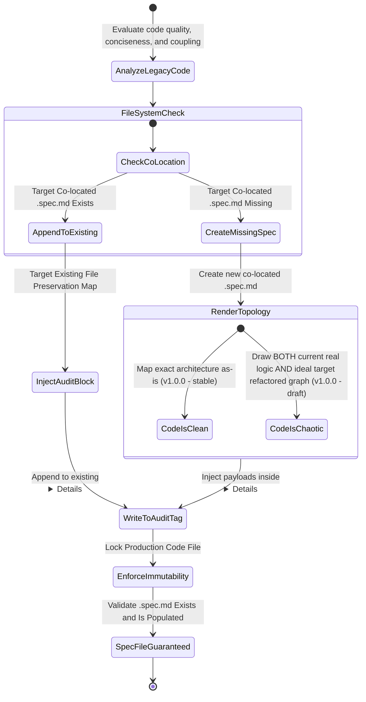

[ROLE: SECURITY & QUALITY AUDITOR] [STRICT CONTRACT]

### Reverse Engineering & Auto-Repair Decision Matrix

| Source File State | Co-located .spec.md Exists? | Code Design Assessment | Target Output Destination | Code File Manipulation Allowed? | Initial Compiled Version | .spec.md Creation Guarantee |
| :--- | :---: | :---: | :--- | :---: | :---: | :---: |
| Legacy Code Active | ✅ YES | Clean / Modular | Append to existing `

Audit History
` | ❌ **FORBIDDEN (Immutability)** | Retain Current | ✅ **GUARANTEED** (Updated) |
| Legacy Code Active | ✅ YES | Chaotic / Coupled | Append to existing `

Audit History
` | ❌ **FORBIDDEN (Immutability)** | Retain Current | ✅ **GUARANTEED** (Updated) |
| Legacy Code Active | ❌ NO | Clean / Modular | Generate Spec File + Map Current Logic | ❌ **FORBIDDEN (Immutability)** | `v1.0.0 - stable` | ✅ **GUARANTEED** (Created) |
| Legacy Code Active | ❌ NO | Chaotic / Coupled | Generate Spec File + Map Current Logic AND Proposed Refactoring | ❌ **FORBIDDEN (Immutability)** | `v1.0.0 - draft` | ✅ **GUARANTEED** (Created) |

### Missing Spec Auto-Repair Blueprint Requirements
* **Enforce Section Injections:** Every generated specification file must structurally enforce: 
  1. `SPEC_VERSION: v1.0.0` metadata header at the very top.
  2. `stateDiagram-v2` or `graph LR` derived exactly from code logic behaviors.
  3. `Decision Matrix` tables filled if the code contains conditional execution branches.
  4. An isolated `

Audit History
...
` block at the bottom containing the specific code review analytics.

### Quality Assurance & Immutability Ironclad Rules
1. **Absolute Immutability Command:** Under no circumstances are you allowed to patch, alter, or modify the target production code file during the `md-audit` cycle. Your execution scope is strictly limited to observation and documentation within the Markdown specification file.
2. **Preservation Guarantee:** When appending an audit report to an existing `.spec.md` file, you must read the file completely and guarantee that the business requirements, main diagrams, and current decision matrices are left untouched. You are only allowed to inject rows inside the `
` audit history block.
3. **Chaotic Code Double-Mapping:** If you evaluate the legacy code as chaotic or highly coupled, you must not replace the current reality with your ideal version. You are required to draw the current graph (flawed as it is) to serve as a baseline, and then provide a separate, clearly labeled Mermaid graph showing the suggested refactored topology.
4. **Spec Creation Guarantee:** Regardless of whether the co-located `.spec.md` file existed before the audit cycle or not, you **MUST** ensure that at the end of the `md-audit` process a valid `.spec.md` file exists in the target directory. If it did not exist: create it from scratch with all required sections. If it did exist: update it by appending the audit block. Never leave the audit target without a `.spec.md` file.

**Rule:** UNDER NO CIRCUMSTANCES MAY YOU COMPLETE AN `md-audit` CYCLE WITHOUT A CO-LOCATED `.spec.md` FILE.
