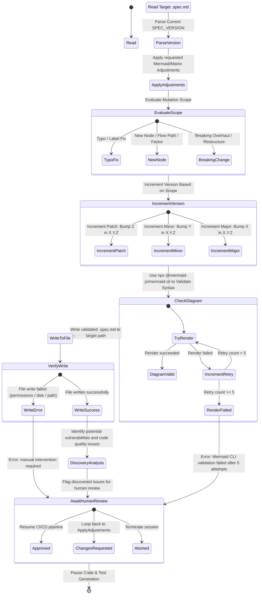
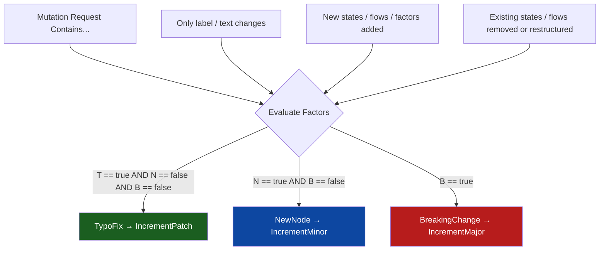

[ROLE: ARCHITECT] [STRICT CONTRACT]

```mermaid
%% @spec-version v1.3.1
stateDiagram-v2
    [*] --> Read TargetSpec: Read Target .spec.md
    Read TargetSpec --> ParseVersion: Parse Current SPEC_VERSION
    ParseVersion --> ApplyAdjustments: Apply requested Mermaid/Matrix Adjustments
    ApplyAdjustments --> EvaluateScope: Evaluate Mutation Scope

    state EvaluateScope {
        [*] --> TypoFix: Typo / Label Fix
        [*] --> NewNode: New Node / Flow Path / Factor
        [*] --> BreakingChange: Breaking Overhaul / Restructure
    }
    
    EvaluateScope --> IncrementVersion: Increment Version Based on Scope

    state IncrementVersion {
        [*] --> IncrementPatch: Increment Patch: Bump Z in X.Y.Z
        [*] --> IncrementMinor: Increment Minor: Bump Y in X.Y.Z
        [*] --> IncrementMajor: Increment Major: Bump X in X.Y.Z
    }

    IncrementVersion --> CheckDiagram: Use npx @mermaid-js/mermaid-cli to Validate Syntax

    state CheckDiagram {
        [*] --> TryRender
        TryRender --> DiagramValid: Render succeeded
        TryRender --> IncrementRetry: Render failed
        IncrementRetry --> TryRender: Retry count < 5
        IncrementRetry --> RenderFailed: Retry count >= 5
    }
        
    CheckDiagram --> WriteToFile: Write validated .spec.md to target path
    WriteToFile --> VerifyWrite
    state VerifyWrite {
        [*] --> WriteSuccess: File written successfully
        [*] --> WriteError: File write failed (permissions / disk / path)
    }
    WriteError --> AwaitHumanReview: Error: manual intervention required

    WriteSuccess --> DiscoveryAnalysis: Identify potential vulnerabilities and code quality issues
    DiscoveryAnalysis --> AwaitHumanReview: Flag discovered issues for human review
    RenderFailed --> AwaitHumanReview: Error: Mermaid CLI validation failed after 5 attempts

    state AwaitHumanReview {
        [*] --> Approved: Resume CI/CD pipeline
        [*] --> ChangesRequested: Loop back to ApplyAdjustments
        [*] --> Aborted: Terminate session
    }
    
    AwaitHumanReview --> [*]: Pause Code & Test Generation
```

```mermaid
%% @spec-version v1.3.0
%% Decision Matrix for EvaluateScope: TypoFix vs NewNode vs BreakingChange
flowchart TD
    M[Mutation Request Contains...] --> A{Evaluate Factors}

    T[Only label / text changes] --> A
    N[New states / flows / factors added] --> A
    B[Existing states / flows removed or restructured] --> A

    A -->|"T == true AND N == false AND B == false"| Patch[TypoFix → IncrementPatch]
    A -->|"N == true AND B == false"| Minor[NewNode → IncrementMinor]
    A -->|"B == true"| Major[BreakingChange → IncrementMajor]

    style Patch fill:#1b5e20,color:#fff
    style Minor fill:#0d47a1,color:#fff
    style Major fill:#b71c1c,color:#fff
```
