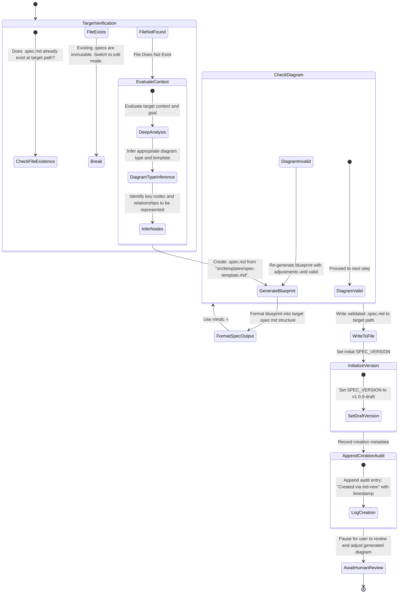

[ROLE: ARCHITECT] [STRICT CONTRACT]

```mermaid
%% @spec-version v1.3.1
stateDiagram-v2
    [*] --> TargetVerification

    state TargetVerification {
        [*] --> CheckFileExistence: Does .spec.md already exist at target path?
        FileExists --> Break: Existing .specs are immutable. Switch to edit mode.
        FileNotFound --> EvaluateContext: File Does Not Exist
    }

    state EvaluateContext {
        [*] --> DeepAnalysis: Evaluate target context and goal
        DeepAnalysis --> DiagramTypeInference: Infer appropriate diagram type and template
        DiagramTypeInference --> InferNodes: Identify key nodes and relationships to be represented
    }

    EvaluateContext --> GenerateBlueprint: Create .spec.md from "src/templates/spec-template.md".
    GenerateBlueprint --> FormatSpecOutput: Format blueprint into target .spec.md structure
    FormatSpecOutput --> CheckDiagram: Use mmdc -i <path/to/diagram.md> --checkSyntax to validate diagram syntax

    state CheckDiagram {
        [*] --> DiagramValid: Proceed to next step
        DiagramInvalid --> GenerateBlueprint: Re-generate blueprint with adjustments until valid
    }
        
    CheckDiagram --> WriteToFile: Write validated .spec.md to target path
    WriteToFile --> InitializeVersion: Set initial SPEC_VERSION

    state InitializeVersion {
        [*] --> SetDraftVersion: Set SPEC_VERSION to v1.0.0-draft
    }

    InitializeVersion --> AppendCreationAudit: Record creation metadata

    state AppendCreationAudit {
        [*] --> LogCreation: Append audit entry: "Created via md-new" with timestamp
    }

    AppendCreationAudit --> AwaitHumanReview: Pause for user to review and adjust generated diagram
    AwaitHumanReview --> [*]
```
