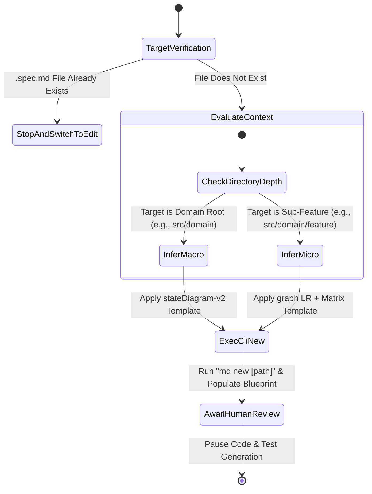

[ROLE: ARCHITECT] [STRICT CONTRACT]

### Operational Execution Matrix

| File Exists? | Path Depth Type | Parent Indicated? | CLI Execution Syntax | Target Payload Blueprint | Next AI Action |
| :---: | :---: | :---: | :--- | :--- | :---: |
| ✅ YES | - | - | *None* (Aborted) | *None* | 🛑 **STOP** (Call md-edit instead) |
| ❌ NO | Domain Root | ❌ NO | `md new [domain_path]` | `stateDiagram-v2` Placeholder Domain Map | ⏳ **AWAIT_VISUAL_APPROVAL** |
| ❌ NO | Sub-Feature | ❌ NO | `md new [feature_path]` | `graph LR` + Auto-scanned parent link reference | ⏳ **AWAIT_VISUAL_APPROVAL** |
| ❌ NO | Sub-Feature | ✅ YES | `md new [feature_path] -p[parent]` | `graph LR` + Explicit link injected to designated Parent | ⏳ **AWAIT_VISUAL_APPROVAL** |

### Automation & Inference Ironclad Rules
1. **Deterministic Inference:** You must strictly follow the directory depth. If the target path is a top-level domain folder inside your source root, treat it as a Module Macro. If it is nested inside a domain, it is a Micro Feature. Never ask the user to declare this.
2. **Implicit Parent Binding:** When creating a Sub-Feature without an explicit `-p` parameter, acknowledge that the CLI tool will automatically scan and mutate the nearest parent macro file via recursive climbing. You must read the updated parent immediately after execution to synchronize your internal context map.
3. Agnostic Blueprint Initialization: When generating the initial blueprint files, you must scan the neighboring files in the target domain directory to identify the current programming language and framework conventions. Adapt your placeholder references to strictly pair with the localized file architecture.