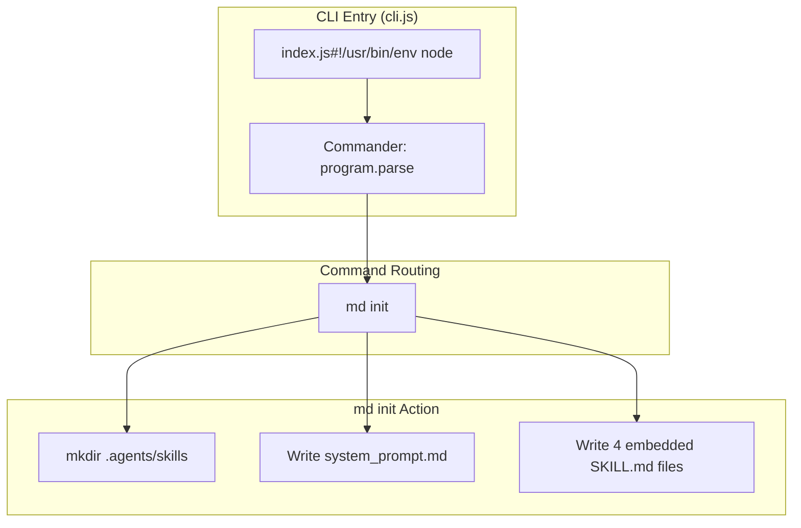
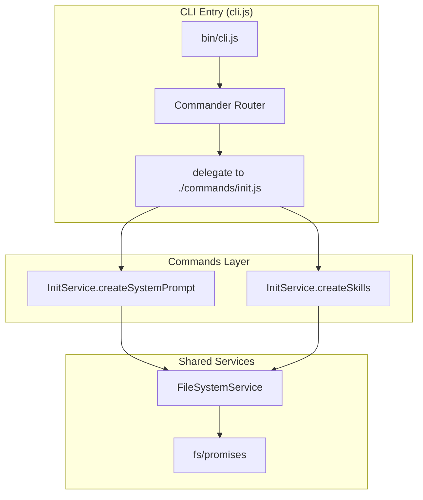

# Refactoring Plan: cli | v3.0.0

## 1. Flow Contract (Mermaid)

### 1.1 Topologia Atual (As-Is)

### 1.2 Topologia Aprovada (To-Be → Refactoring Target)

## 2. Decision Matrix

| Código Atual | Co-located .spec.md Exists? | Design Assessment | Ação de Auditoria | Manipulação de Código Permitida? | Versão Inicial |
| :--- | :---: | :---: | :--- | :---: | :---: |
| `bin/cli.js` (421 linhas) | ❌ NO | Caótico / Acoplado | Auto-gerar Spec + Mapear Lógica Atual E Proposta | ❌ **FORBIDDEN (Immutability)** | `v1.0.0` |
| `src/commands/init.js` + `src/services/InitService.js` + `src/services/FileSystemService.js` (refatorado) | ✅ YES (this spec) | Refatorado / Modular | Aprovado com diagrama To-Be como alvo de implementação | ✅ **ALLOW (Refactoring)** | `v3.0.0` |

### Fatores Primitivos de Acoplamento

| Fator | Valor | Impacto |
| :--- | :---: | :--- |
| Arquivo único monolítico? | ✅ YES | Acoplamento extremo; todas as responsabilidades no mesmo closure |
| Lógica de template embutida? | ✅ YES | 4 skills + 2 templates inline no código (string templates >20KB) |
| Duplicação entre `new` e `audit`? | ❌ N/A (removido) | Comandos `new`, `edit`, `audit` e `impl` foram removidos do escopo |
| Tratamento de erros inconsistente? | ❌ N/A (removido) | Comandos `edit`/`audit`/`impl` removidos |
| Sem separação CLI/Business? | ❌ NO | `init` permanece com separação CLI/Business via `src/commands/init.js` |
| Lógica de crawling de diretório isolada? | ❌ N/A (removido) | `findClosestMacro` removido junto com comando `new` |
| Código testável? | ❌ NO | Sem módulos exportados; dependência direta de `fs`, `path` sem injeção |

## 3. Audit History

Click to expand

| Data | Auditor | Versão | Resumo das Mudanças |
| :--- | :--- | :---: | :--- |
| 2026-05-27 | MDDD-Audit Agent (Cline) | v1.0.0 | Auditoria inicial. Código classificado como **Caótico/Acoplado**. Diagrama As-Is documenta a topologia real (monolítica). Diagrama To-Be propõe separação em Commands Layer + Shared Services + Template Engine + Testes. Decisão de imutabilidade: código de produção não foi modificado. |
| 2026-05-27 | Cline (Agent-Actor) | v2.0.0 | **MAJOR Mutation (v1.0.0 → v2.0.0):** Aprovada refatoração estrutural do monolito `bin/cli.js` (421 linhas) para arquitetura modular: Commands Layer (`src/commands/*.js`) + Shared Services (`src/services/*.js`) + Template Engine (`src/services/TemplateFactory.js`) + Unit Tests. Removida restrição FORBIDDEN (Immutability). Diagrama To-Be promovido a alvo de implementação oficial. |
| 2026-05-27 | Cline (Agent-Actor) | v3.0.0 | **MAJOR Mutation (v2.0.0 → v3.0.0):** Removidos comandos `new`, `edit`, `audit` e `impl` do escopo do CLI. Diagramas As-Is e To-Be simplificados para refletir apenas o comando `init` restante. Matriz de decisão e fatores de acoplamento atualizados. |

### Análise de Qualidade

- **Acoplamento**: ⚠️ **MÉDIO** - O comando `init` restante ainda reside em `bin/cli.js` mas delega para `src/commands/init.js`.
- **Coesão**: ✅ **ALTA** - Escopo reduzido a apenas inicialização do ambiente MDDD.
- **Testabilidade**: ⚠️ **MÉDIA** - Serviços são injetados via construtor, mas `bin/cli.js` não exporta funções para teste unitário isolado.
- **Manutenibilidade**: ✅ **ALTA** - Código simplificado com apenas um comando e clara separação de responsabilidades.

