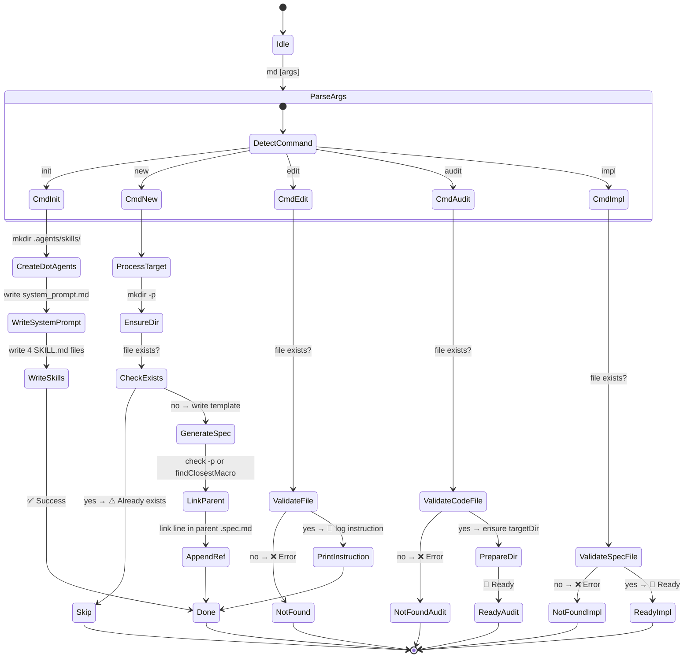

# CLI: mddd-cli | v1.0.0

## 1. Flow Contract (Mermaid)

## 2. Decision Matrix

### 2.1 Command Routing

| Input Pattern | Command | Action | Output |
| :--- | :--- | :--- | :--- |
| `md init` | `init` | Create `.agents/` + `system_prompt.md` + 4 skill files | ✅ Created / ✅ Already exists |
| `md new <path>` | `new` | Create co-located `.spec.md` at path; optional parent linking | ✅ Created / ⚠️ Exists / ❌ Error |
| `md edit <file> <msg>` | `edit` | Validate file, print instruction to stdout | 📝 Ready / ❌ Not found |
| `md audit <file>` | `audit` | Validate code file, ensure dir exists | 🚀 Ready / ❌ Not found |
| `md impl <file>` | `impl` | Validate spec file exists | 🚀 Ready / ❌ Not found |

### 2.2 `init` Command — File Generation

| Condition | Action | Next State |
| :--- | :--- | :--- |
| `./.agents` does not exist | `mkdir .agents` | Continue |
| `./.agents/skills` does not exist | `mkdir .agents/skills` | Continue |
| Always | Write `system_prompt.md` | Continue |
| For each skill (`md-new`, `md-edit`, `md-audit`, `md-impl`) | Create folder + `SKILL.md` | Continue → Done |
| Skill `SKILL.md` already exists | Delete old, write new | Replace |

### 2.3 `new` Command — Parent Linking

| Condition | Action | Next State |
| :--- | :--- | :--- |
| `--parent` provided AND file exists | Append link line to parent | ✅ Linked |
| `--parent` provided AND file NOT found | `process.exit(1)` with error | ❌ Fatal |
| `--parent` NOT provided AND NOT `--macro` | Auto-search via `findClosestMacro()` | ✅ Linked (if found) / No link (if none) |
| `--macro` flag set | Skip parent linking (unless `-p` explicit) | Macro template generated |

### 2.4 `findClosestMacro(currentDir)` — Traversal Logic

| Condition | Action | Return |
| :--- | :--- | :--- |
| Current dir contains `*.spec.md` (excluding current dir's own spec) | Return full path to that file | Path string |
| No matching file in current dir | Move to parent directory | Recurse |
| Reaches filesystem root (e.g., `/`) | Return `null` | `null` |
| `fs.readdirSync` throws (permission denied) | `break` out of loop | `null` |

## 3. Architecture Notes

- **Entry point**: `bin/cli.js` (referenced in `package.json` as `"bin": {"md": "bin/cli.js"}`)
- **Dependencies**: `commander` (argument parsing), `picocolors` (terminal coloring)
- **Runtime**: Node.js >= 18 (ESM — `"type": "module"`)
- **Pattern**: Each command is a self-contained `.action()` callback. Shared utility (`findClosestMacro`) is a module-level function with clear single responsibility.
- **Error handling**: Consistent pattern — validate file existence early, exit with code 1 + red message on failure, green/blue/yellow for success/warnings.

## 4. Audit History

Click to expand

| Date | Auditor | Version | Notes |
| :--- | :--- | :--- | :--- |
| 2026-05-26 | AI (MDDD audit) | v1.0.0 | Initial spec: code is modular, cohesive, clean. Mapped as-is. |

