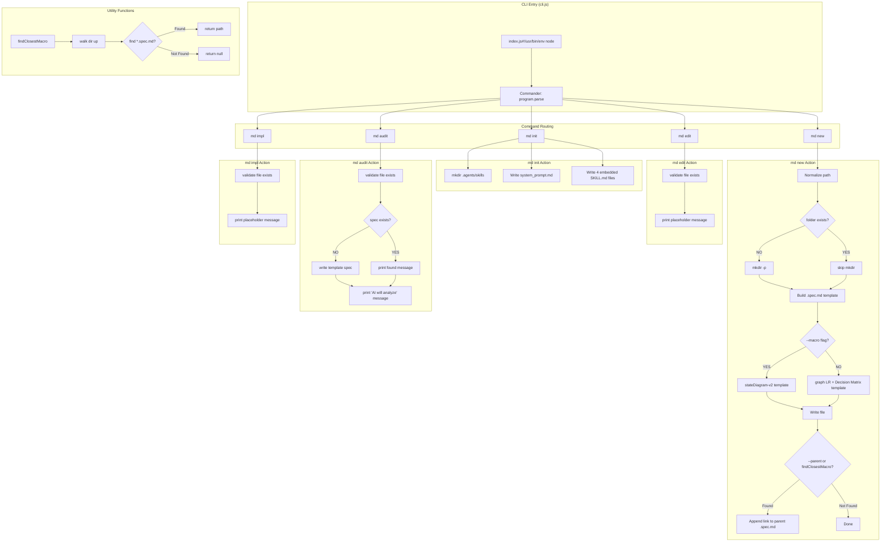
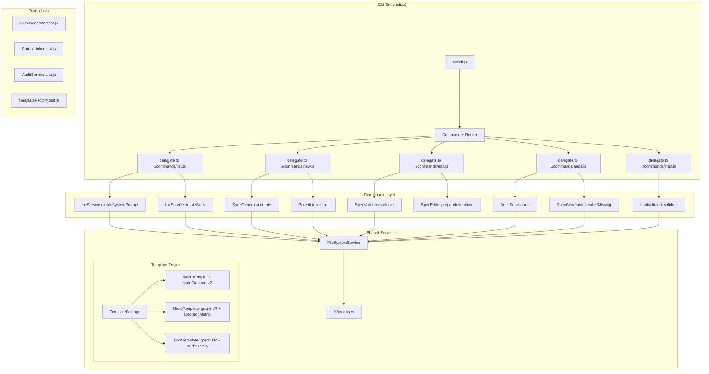

# Audit: cli | v1.0.0

## 1. Flow Contract (Mermaid)

### 1.1 Topologia Atual (As-Is)

### 1.2 Topologia Refatorada Proposta (To-Be)

## 2. Decision Matrix

| Código Atual | Co-located .spec.md Exists? | Design Assessment | Ação de Auditoria | Manipulação de Código Permitida? | Versão Inicial |
| :--- | :---: | :---: | :--- | :---: | :---: |
| `bin/cli.js` (421 linhas) | ❌ NO | Caótico / Acoplado | Auto-gerar Spec + Mapear Lógica Atual E Proposta | ❌ **FORBIDDEN (Immutability)** | `v1.0.0` |

### Fatores Primitivos de Acoplamento

| Fator | Valor | Impacto |
| :--- | :---: | :--- |
| Arquivo único monolítico? | ✅ YES | Acoplamento extremo; todas as responsabilidades no mesmo closure |
| Lógica de template embutida? | ✅ YES | 4 skills + 2 templates inline no código (string templates >20KB) |
| Duplicação entre `new` e `audit`? | ✅ YES | Ambos criam `.spec.md` com templates semelhantes |
| Tratamento de erros inconsistente? | ✅ YES | `edit`/`audit`/`impl` usam `process.exit(1)`, `new` usa `process.exit(0/1)` |
| Sem separação CLI/Business? | ✅ YES | Comandos Commander executam lógica inline sem camada de serviço |
| Lógica de crawling de diretório isolada? | ❌ NO | `findClosestMacro` é função separada (bom), mas não testável isoladamente |
| Código testável? | ❌ NO | Sem módulos exportados; dependência direta de `fs`, `path` sem injeção |

## 3. Audit History

Click to expand

| Data | Auditor | Versão | Resumo das Mudanças |
| :--- | :--- | :---: | :--- |
| 2026-05-27 | MDDD-Audit Agent (Cline) | v1.0.0 | Auditoria inicial. Código classificado como **Caótico/Acoplado**. Diagrama As-Is documenta a topologia real (monolítica). Diagrama To-Be propõe separação em Commands Layer + Shared Services + Template Engine + Testes. Decisão de imutabilidade: código de produção não foi modificado. |

### Análise de Qualidade

- **Acoplamento**: ⚠️ **ALTO** - Toda lógica em um único arquivo de 421 linhas. Dependências diretas de `fs`, `path` e `Commander` sem abstração.
- **Coesão**: ⚠️ **BAIXA** - O comando `init` mistura criação de sistema de arquivos, templates de sistema e escrita de skills.
- **Testabilidade**: ❌ **NENHUMA** - Nenhuma função é exportada; sem DI (injeção de dependência); sem mocks possíveis sem ferramentas como `proxyquire`.
- **Manutenibilidade**: ⚠️ **MÉDIA-BAIXA** - Templates embutidos no código dificultam manutenção; lógica de crawling de diretório é frágil (usa `readdirSync`).
- **Segurança**: ✅ Usa `EACCES`/`EPERM` handler no `findClosestMacro`.

### Recomendações de Refatoração

1. **Separar em módulos**: `src/commands/init.js`, `src/commands/new.js`, `src/commands/edit.js`, `src/commands/audit.js`, `src/commands/impl.js`
2. **Extrair Template Engine**: `src/services/TemplateFactory.js` com templates parametrizados
3. **Extrair FileSystemService**: `src/services/FileSystemService.js` com injeção de dependência para testabilidade
4. **Criar ParentLinker**: `src/services/ParentLinker.js` com crawler testável
5. **Adicionar testes unitários**: Coverage mínimo de 80% para todas as funções extraídas
6. **Exportar funções**: Usar `export` em vez de closures anônimas no `.action()`
7. **Migrar para `fs/promises`**: Substituir `readdirSync`/`writeFileSync` por `async/await` para melhor gerenciamento de concorrência

