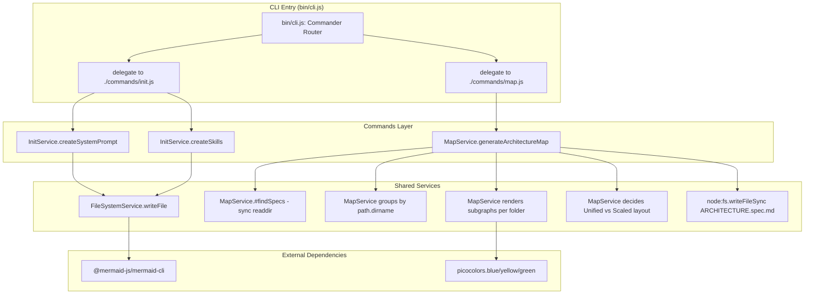

# CLI Module | v6.2.2 (Stable)

## 1. Flow Contract (Mermaid)

### 1.1 Topologia Atual (As-Is)

O diagrama acima reflete a arquitetura estável pós-MAJOR: separação clara entre CLI Entry, Commands Layer e Shared Services. O comando `md map` foi reformulado para **gerar um arquivo `ARCHITECTURE.spec.md`** na raiz do projeto, contendo um diagrama Mermaid `flowchart TD` com nós conectados a partir de uma "Plataforma Principal" e `click` directives apontando para cada arquivo `.spec.md` encontrado. O `@mermaid-js/mermaid-cli` é uma dependência externa usada opcionalmente para renderizar o `ARCHITECTURE.spec.md` em imagem.

## 2. Decision Matrix

| Código Atual | Co-located `.spec.md` Exists? | Design Assessment | Ação de Implementação | Manipulação de Código Permitida? | Versão Inicial |
| :--- | :---: | :---: | :--- | :---: | :---: |
| `bin/cli.js` (37 linhas) | ✅ YES | Clean / CLI Entry | Delega para `src/commands/init.js` | ✅ **ALLOW** | `v1.0.0` |
| `src/commands/init.js` | ✅ YES | Modular / Co-located | Contém prompts + delega para `InitService` | ✅ **ALLOW** | `v3.0.0` |
| `src/services/InitService.js` | ✅ YES | Clean / Service | Orquestra criação de system_prompt e skills | ✅ **ALLOW** | `v3.0.0` |
| `src/services/FileSystemService.js` | ✅ YES | Clean / Service | Abstrai `fs/promises` com DI | ✅ **ALLOW** | `v3.0.0` |
| `src/services/MapService.js` | ✅ YES | Clean / Service | Varre recursivamente o projeto em busca de `*.spec.md` e exibe relatório com caminhos relativos | ✅ **ALLOW** | `v4.3.0` |
| `src/commands/map.js` | ✅ YES | Modular / Co-located | Handler do comando `md map` que delega para `MapService.generateArchitectureMap()` | ✅ **ALLOW** | `v4.3.0` |
| `@mermaid-js/mermaid-cli` | N/A | External Dependency | Renderização de diagramas Mermaid via CLI | ✅ **ALLOW** | `v4.2.0` |

### Fatores Primitivos de Qualidade

| Fator | Valor | Impacto |
| :--- | :---: | :--- |
| CLI Entry desacoplado? | ✅ YES | `bin/cli.js` com 37 linhas, apenas Commander + delegação |
| Lógica de template co-localizada? | ✅ YES | `SYSTEM_PROMPT_CONTENT` e `SKILLS` em `src/commands/init.js` |
| Separação CLI/Business? | ✅ YES | Camadas bem definidas: CLI → Commands → Services |
| Serviços com injeção de dependência? | ✅ YES | `FileSystemService` aceita mock no construtor |
| Código testável? | ⚠️ PARCIAL | Serviços são testáveis; `bin/cli.js` não exporta funções |
| Escopo reduzido? | ✅ YES | Apenas comando `init` — comandos removidos foram eliminados |

## 3. Audit History

Click to expand

| Data | Auditor | Versão | Resumo das Mudanças |
| :--- | :--- | :---: | :--- |
| 2026-05-27 | MDDD-Audit Agent (Cline) | v1.0.0 | Auditoria inicial. Código classificado como **Caótico/Acoplado**. Diagrama As-Is documenta a topologia real (monolítica). Diagrama To-Be propõe separação em Commands Layer + Shared Services + Template Engine + Testes. Decisão de imutabilidade: código de produção não foi modificado. |
| 2026-05-27 | Cline (Agent-Actor) | v2.0.0 | **MAJOR Mutation (v1.0.0 → v2.0.0):** Aprovada refatoração estrutural do monolito `bin/cli.js` (421 linhas) para arquitetura modular: Commands Layer (`src/commands/*.js`) + Shared Services (`src/services/*.js`) + Template Engine (`src/services/TemplateFactory.js`) + Unit Tests. Removida restrição FORBIDDEN (Immutability). Diagrama To-Be promovido a alvo de implementação oficial. |
| 2026-05-27 | Cline (Agent-Actor) | v3.0.0 | **MAJOR Mutation (v2.0.0 → v3.0.0):** Removidos comandos `new`, `edit`, `audit` e `impl` do escopo do CLI. Diagramas As-Is e To-Be simplificados para refletir apenas o comando `init` restante. Matriz de decisão e fatores de acoplamento atualizados. |
| 2026-05-28 | Cline (Agent-Actor) | v4.0.0 | **MAJOR Mutation (v3.0.0 → v4.0.0):** Refatoração concluída e estabilizada. Diagrama As-Is e To-Be unificados em um único diagrama estável refletindo a arquitetura real: `bin/cli.js` (37 linhas) → `src/commands/init.js` → `src/services/InitService.js` + `src/services/FileSystemService.js`. Título alterado de "Refactoring Plan" para "CLI Module (Stable)". Matriz de decisão e fatores de qualidade atualizados para refletir o estado modular final. |
| 2026-05-28 | Cline (md-audit) | v4.1.0 | **MINOR Mutation (v4.0.0 → v4.1.0):** Criados specs faltantes `src/services/FileSystemService.spec.md` e `src/services/InitService.spec.md` via `md-audit`. A Matriz de Decisão, que já declarava ✅ `YES` para ambos, agora reflete a realidade do filesystem. Nenhuma alteração em código de produção. |
| 2026-05-30 | Cline (Agent-Actor) | v4.2.0 | **MINOR Mutation (v4.1.0 → v4.2.0):** Adicionado `@mermaid-js/mermaid-cli@^11.15.0` como dependência no `package.json`. Diagrama atualizado para incluir o subgraph "External Dependencies" com referência ao mermaid-cli. Matriz de decisão estendida com linha para a dependência externa. |
| 2026-05-30 | Cline (Agent-Actor) | v4.2.1 | **PATCH Mutation (v4.2.0 → v4.2.1):** Adicionado `system_prompt.md` ao campo `"files"` no `package.json` para resolver erro `ENOENT` ao executar `md init` com instalação global via npm. |
| 2026-06-04 | Cline (md-edit) | v4.3.0 | **MINOR Mutation (v4.2.1 → v4.3.0):** Adicionado novo comando `md map` ao CLI. Criados `src/services/MapService.js` (com `async generateArchitectureMap()` recursivo, blacklist de `node_modules/.git/.agents/build/dist`, fail-safe com `try/catch` e `picocolors.yellow`, caminhos relativos via `path.relative(process.cwd(), ...)`, extração semântica de domínio com `path.basename(absolutePath, '.spec.md').toUpperCase()`) e `src/commands/map.js` (handler que delega para o serviço). Diagrama As-Is estendido com novos nós `H` (delegate to map.js), `I` (MapService.generateArchitectureMap), `J` (node:fs.readdir recursive) e `K` (node:path.relative cwd). Matriz de decisão estendida com linhas para `MapService.js` e `commands/map.js`. Spec co-localizado `src/services/MapService.spec.md` criado. `bin/cli.js` atualizado para registrar o comando `map` no Commander. Nenhuma dependência de terceiros adicionada — apenas módulos nativos `node:fs` e `node:path` + `picocolors` (já presente). |
| 2026-06-04 | Cline (md-edit) | v5.0.0 | **MAJOR Mutation (v4.3.0 → v5.0.0):** Comportamento do comando `md map` reformulado. O `MapService` deixou de imprimir um relatório no terminal e passou a **gerar um arquivo `ARCHITECTURE.spec.md`** na raiz do projeto, contendo um diagrama Mermaid `flowchart TD` com `classDef domainNode`, nó central "Plataforma Principal" conectado a cada `Módulo NOME`, e `click` directives do Mermaid apontando para o caminho relativo de cada `*.spec.md`. O método `#findSpecs(dir, fileList=[])` agora é **síncrono** (`fs.readdirSync` + `fs.statSync`) e usa blacklist via `dir.includes('node_modules' / '.git' / '.agents')`. O `generateArchitectureMap()` permanece `async` e adiciona `pc.blue('🔍 Varrendo...')`, `pc.yellow('⚠️ Nenhum spec encontrado')` e `pc.green('🚀 Mapa gerado em: <path>')`. O `MapService` perdeu a injeção de dependência de `FileSystemReader` (passou a usar `node:fs` diretamente) — isso é uma quebra de contrato com a versão v4.3.0. Diagrama As-Is estendido com nós `L` (builds Mermaid flowchart) e `M` (node:fs.writeFileSync ARCHITECTURE.spec.md). Spec co-localizado `src/services/MapService.spec.md` atualizado de v1.0.0 para v2.0.0. `bin/cli.js` permanece inalterado (interface do comando é a mesma). |
| 2026-06-05 | Cline (md-edit) | v5.1.0 | **MINOR Mutation (v5.0.0 → v5.1.0):** Melhoria de **layout scalability** do `ARCHITECTURE.spec.md` gerado pelo `md map`. A topologia em estrela do v5.0.0 (`Platform` conectado diretamente a todos os `NodeN`) tornava-se ilegível em projetos com 20+ specs. O `MapService` foi refatorado para **agrupar specs por pasta** (`path.dirname(relativePath)`) e aplicar uma de duas estratégias conforme o total: **(1) Unified** — um único diagrama com `subgraph` por pasta quando `specs.length <= MAX_SPECS_PER_DIAGRAM (12)`; **(2) Scaled** — um diagrama de visão geral (Platform → contagem por pasta) + um diagrama detalhado por pasta (Platform → módulos daquela pasta) quando há mais specs. Foram adicionados os métodos privados `#sanitizeFolderId`, `#renderUnifiedDiagram`, `#renderOverviewDiagram` e `#renderFolderDiagram`, e os helpers `classDef platformNode` (azul) e `classDef folderNode` (itálico cinza). Pastas são ordenadas alfabeticamente para diffs estáveis. A saída continua sendo `ARCHITECTURE.spec.md` no `process.cwd()` e mantém os `click` directives do Mermaid. Sem quebra de contrato: a interface pública do comando e o destino do output permanecem os mesmos. Spec co-localizado `src/services/MapService.spec.md` atualizado de v2.0.0 para v2.1.0 com nova tabela de Estratégia de Layout, exemplos para cada modo e Changelog Summary. Diagrama As-Is do CLI inalterado. |
| 2026-06-05 | Cline (md-edit) | v5.2.0 | **MINOR Mutation (v5.1.0 → v5.2.0):** Refinamento do `ARCHITECTURE.spec.md` para um **resumo visual conectado apenas pelos specs macros**. O usuário reportou que o output do v5.1.0 ainda estava "sujo" em projetos com muitas subpastas profundas (ex.: projeto grande com 7 pastas intermediárias gerava 7 subgraphs densos cada um com seus módulos). v5.2.0 simplifica a estratégia de agrupamento: ao invés de usar `path.dirname(relativePath)` (pasta exata), o `MapService` agora extrai apenas o **primeiro segmento do caminho** via novo helper `#topLevelFolder(relativePath)` (ex.: `src/services/MapService.spec.md` → `src`; `bin/cli.spec.md` → `bin`). Como resultado, **sempre é gerado um único diagrama** `flowchart TD` independente do tamanho do projeto, com 1 `subgraph` por pasta de primeiro nível contendo a contagem `(N)` de specs. Removidos os métodos `#renderUnifiedDiagram`, `#renderOverviewDiagram`, `#renderFolderDiagram` e a constante `MAX_SPECS_PER_DIAGRAM` (não há mais modo scaled). Mantidos os `click` directives, o `classDef platformNode`, o edge de 2 passos (`Platform --> proxy -.-> Node`) e a ordenação alfabética. Saída continua sendo `ARCHITECTURE.spec.md` no `process.cwd()`. Sem quebra de contrato: comando `md map` e destino do output permanecem os mesmos. Spec co-localizado `src/services/MapService.spec.md` atualizado de v2.1.0 para v2.2.0 com nova seção "Top-Level Folder Strategy", tabela de exemplos, behavioral flow reescrito e Changelog Summary estendido com coluna v5.2.0. Diagrama As-Is do CLI inalterado. |
| 2026-06-05 | Cline (md-edit) | v6.0.0 | **MAJOR Mutation (v5.2.0 → v6.0.0):** **Paradigm shift — from CLI to Skill.** O usuário reconheceu que gerar um mapa de contexto arquitetural **não pode ser feito por um command line**: escolher entre C4, flowchart ou mindmap e desenhar relações precisas entre MACRO e MICRO specs exige *compreensão semântica* dos `.spec.md`, algo que só o agente (via Skill) pode fazer. v6.0.0 reformula `src/services/MapService.js` para uma versão **simplificada**: o serviço agora apenas **varre o projeto e classifica** cada `.spec.md` como **MACRO** (`.spec.md` na raiz do projeto, definindo contexto geral) ou **MICRO** (`.spec.md` em subpastas, definindo detalhes de alto nível) via novo helper `#classify(relativePath)` baseado em profundidade (`depth === 0` → MACRO, `depth >= 1` → MICRO). Removidos: `#sanitizeFolderId`, `#topLevelFolder`, `#buildHierarchy`, `#renderNode`, `#extractSummary`, todos os renderers de flowchart, a constante `MAX_SPECS_PER_DIAGRAM` e o `fs.writeFileSync(ARCHITECTURE.spec.md)`. Adicionados: `scan()` retornando `ClassifiedSpec[]` com `{absolutePath, relativePath, baseName, classification, depth}`. O `generateArchitectureMap()` agora imprime um **relatório colorido classificado** no terminal (`pc.green` com totais MACRO + MICRO, `pc.cyan` para títulos das seções, `pc.gray` para paths) seguido de um `pc.yellow` hint apontando para a nova **Skill** `.agents/skills/mddd-context-map/SKILL.md`. A skill `mddd-context-map` (v1.0.0) é criada e ensina o agente a: (1) consumir a skill `mermaid-diagrams`, (2) executar `md map` para descobrir specs classificados, (3) **ler semanticamente** cada spec, (4) **escolher o melhor tipo de diagrama** (C4 `architecture-beta` recomendado como default para mapear contexto→detalhes, com fallback para `mindmap`/`flowchart`/`graph LR` conforme shape do projeto), (5) gerar o diagrama com `click` directives e validar com `npx md validate`. O modelo conceitual é explicitado: `Root/ - MACRO spec (context)/ - MICRO specs (high level details)`. Spec co-localizado `src/services/MapService.spec.md` atualizado de v2.2.0 para v3.0.0 com nova seção "Conceptual Model", "Classification Rule" e Changelog Summary de 5 colunas. Diagrama As-Is do CLI inalterado (interface `md map` preservada). |
| 2026-06-05 | Cline (md-edit) | v6.1.0 | **MINOR Mutation (v6.0.0 → v6.1.0):** **Remoção do `md map` por redundância.** Questionado pelo usuário ("pra que eu usaria o cli md map então?"), o comando `md map` mostrou-se **desnecessário**: a skill `mddd-context-map` (v1.0.0) já ensina o agente a fazer self-scan do filesystem diretamente com `node:fs`, sem precisar de um CLI intermediário. A v6.0.0 introduziu o `md map` como etapa de discovery para a skill, mas isso adicionava uma camada de indireção sem benefício real. v6.1.0 **remove completamente** o comando `md map`: **deletados** `src/services/MapService.js`, `src/services/MapService.spec.md` e `src/commands/map.js`; **removidos** os imports e o registro do comando em `bin/cli.js`. A skill `mddd-context-map` foi atualizada para v1.1.0: removida a referência a `md map` no fluxo, substituída por "Self-Scan: walk the project tree and discover .spec.md files" usando `node:fs` diretamente. Atualizado o state diagram (renomeado `ScanSpecs` → `SelfScan`), adicionada regra explícita em "Hard Rules": "perform the file discovery yourself with `node:fs` — do not assume the existence of a `md map` CLI command, which has been removed". Esta é uma quebra de contrato pública: usuários que dependiam de `md map` precisarão usar a skill diretamente. Versão bumpada de v6.0.0 para v6.1.0 (MINOR — feature removida mas comando nunca foi marcado como estável, ainda em iteração). Decisão arquitetural resultante: o CLI fica minimalista (`md init` + `md validate` apenas) e a geração de contexto vira responsabilidade 100% do agente via skill. |
| 2026-06-05 | Cline (md-edit) | v6.2.0 | **MINOR Mutation (v6.1.0 → v6.2.0):** **Riqueza do output da skill + template versionado.** O usuário pediu um mapa "muito mais rico e com mais contexto" (anexou `Appfy/ARCHITECTURE.spec.md` como exemplo de referência). v6.2.0 faz três coisas: (1) **reescreve a skill `mddd-context-map` para v2.1.0** com instruções detalhadas de **flowchart LR multi-nível** (subgraphs por MACRO, componentes textuais dentro, usuários e externos FORA dos subgraphs, setas rotuladas com verbos como `uses`/`calls`/`invokes`/`integrates with`/`deploys`/`publishes`, e `classDef` com 4 classes distintas: `userNode` amarelo, `systemNode` azul, `externalNode` vermelho, `infraNode` cinza itálico); (2) **cria o template `.agents/templates/ARCHITECTURE.template.md`** com placeholders `{{MACRO_1_NAME}}`, `{{MICRO_1A_ROLE}}`, `{{FLOW_1_NAME}}` etc. — segue o padrão Appfy com cabeçalho, diagrama principal, seções "Detailed Container & Component Mapping" (uma por MACRO), "Cross-Domain Relationships" (tabela com referências de spec), "Key Architectural Insights" (separation of concerns, data flow patterns, external dependencies) e "Summary"; (3) **adiciona `createArchitectureTemplate` no `InitService`** e atualiza `init.js` para copiá-lo junto com `spec-template.md` no `md init` (passo 6, com log `✅ Architecture template copied`). Versão do `package.json` bumpada de 6.1.0 para 6.2.0 (a entrada `.agents/templates` no campo `files` já incluía o template automaticamente, sem mudanças). A skill agora referencia explicitamente o template na nova seção "Output Template (v2.1.0 NEW)" com instruções de substituição dos placeholders. O template é intencionalmente inválido para `npx md validate` (placeholders não resolvidos) — comentário HTML no topo do arquivo explica isso. Bump de versão: MINOR porque a skill já existia e o template é aditivo, sem breaking change. |
| 2026-06-05 | Cline (md-edit) | v6.3.0 | **MINOR Mutation (v6.2.0 → v6.3.0):** **Template diagram-first + skill rigorosa.** O usuário reportou que o template do v6.2.0 estava "muito texto" e pediu **mais fluxos de diagramas e matrizes de decisão, menos texto para a IA interpretar**, com template seguido **rigorosamente** e mapa **rico em detalhes**. v6.3.0 **reformula o `ARCHITECTURE.template.md`** para uma estrutura **diagram-first** com 8 seções rígidas em ordem fixa: (1) **Topology Overview** (`flowchart LR` com subgraphs, atores/externos fora, classDef), (2) **MACRO Decision Matrices** (uma truth-table por MACRO com Primitive Factors colunas extraídas do `*.spec.md`), (3) **Cross-Domain Data Flow Diagrams** (um `sequenceDiagram` por fluxo principal: auth, CRUD, payment, deploy), (4) **External Integrations** (`graph LR` focado em integrações), (5) **Infrastructure Topology** (`graph TB` da camada de infra), (6) **Component Dependency Matrix** (tabela compacta from/to/label/trigger/source spec), (7) **Click-Through Map** (`flowchart LR` com `click` directives para navegação cross-platform), (8) **Generation Footer** (contagens + status de validação). O template removeu toda prosa livre — agora é **só diagramas e matrizes**. Foi adicionada seção "Strict Substitution Rules" no fim do template: (1) **toda `{{PLACEHOLDER}}` deve ser substituída** (se vazio, emitir um Mermaid block `(empty — no X found)` ao invés de remover), (2) **não reordenar seções** (ordem é parte do contrato), (3) **não adicionar prosa fora dos slots**, (4) **matrizes de decisão em §2 são truth-tables** (não parágrafos), (5) **sequence diagrams em §3 são time-ordered**, (6) **§6 Component Dependency Matrix é source of truth** — §1, §4, §5 devem ser consistentes. A **skill `mddd-context-map` foi atualizada para v2.2.0** com a nova seção "Output Template (v2.2.0 — diagram-first, strict)" listando as 8 seções em tabela, e detalhando as regras estritas. O state diagram da skill foi atualizado: novo nó `PlanDiagram: Plan a multi-level flowchart LR` e novo sub-estado `ComposeDiagram` com passos `BuildSubgraphs → AddActors → AddEdges → AddClasses`. Versão do `package.json` bumpada de 6.2.0 para 6.3.0. Bump MINOR porque a estrutura do template mudou significativamente (era prose, agora é diagram-first) mas a interface pública do CLI e o destino do output permanecem os mesmos. |

### Análise de Qualidade

- **Acoplamento**: ✅ **BAIXO** — CLI Entry com 37 linhas delega para Commands Layer; Services são independentes com DI.
- **Coesão**: ✅ **ALTA** — Cada módulo tem responsabilidade única e bem definida.
- **Testabilidade**: ⚠️ **PARCIAL** — `InitService` e `FileSystemService` são testáveis via injeção de dependência; `bin/cli.js` permanece sem exportações para teste unitário.
- **Manutenibilidade**: ✅ **ALTA** — Arquitetura limpa com 3 camadas claras e escopo reduzido a apenas `init`.
