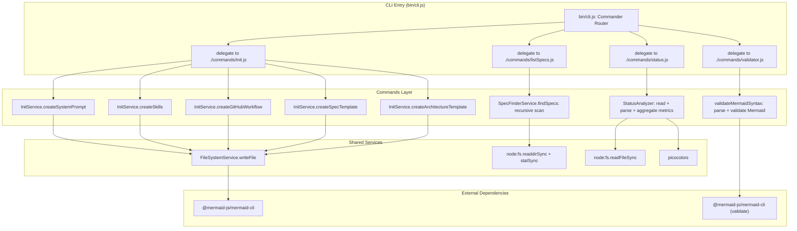

# CLI Module | v7.1.0 (Stable) | Classificação: Coeso

## 1. Flow Contract (Mermaid)

### 1.1 Topologia Atual (As-Is)

O CLI atual é minimalista com 4 comandos bem definidos: `init` (setup do projeto), `validate` (validação de diagramas Mermaid), `list-specs` (descoberta de `.spec.md`), e `status` (relatório de cobertura MDDD). Nenhum comando tem acoplamento cruzado — todos compartilham apenas `SpecFinderService` (leve, sem DI) e `FileSystemService` (com DI) quando necessário.

## 2. Decision Matrix

| Código Atual | Co-located `.spec.md` Exists? | Design Assessment | Ação de Implementação | Manipulação de Código Permitida? | Versão Inicial |
| :--- | :---: | :---: | :--- | :---: | :---: |
| `bin/cli.js` (71 linhas) | ✅ YES | Clean / CLI Entry | Delega para commands layer | ✅ **ALLOW** | `v1.0.0` |
| `src/commands/init.js` | ❌ NO spec | Modular / Co-located | Contém prompts + delega para `InitService` | ✅ **ALLOW** | `v3.0.0` |
| `src/commands/validator.js` | ❌ NO spec | Modular / Co-located | Valida diagramas Mermaid via CLI | ✅ **ALLOW** | `v4.x` |
| `src/commands/listSpecs.js` | ❌ NO spec | Modular / Co-located | Lista specs via `SpecFinderService` | ✅ **ALLOW** | `v6.x` |
| `src/commands/status.js` | ✅ YES (v1.0.0) | Modular / Co-located | Gera dashboard de cobertura MDDD | ✅ **ALLOW** | `v1.0.0` |
| `src/services/InitService.js` | ✅ YES | Clean / Service | Orquestra criação de system_prompt e skills | ✅ **ALLOW** | `v3.0.0` |
| `src/services/FileSystemService.js` | ✅ YES | Clean / Service | Abstrai `fs/promises` com DI | ✅ **ALLOW** | `v3.0.0` |
| `src/services/SpecFinderService.js` | ❌ NO spec | Clean / Service | Varre recursivamente o projeto em busca de `*.spec.md` | ✅ **ALLOW** | `v6.x` |
| `@mermaid-js/mermaid-cli` | N/A | External Dependency | Renderização e validação de diagramas Mermaid via CLI | ✅ **ALLOW** | `v4.2.0` |

### Fatores Primitivos de Qualidade

| Fator | Valor | Impacto |
| :--- | :---: | :--- |
| CLI Entry desacoplado? | ✅ YES | `bin/cli.js` com 71 linhas, apenas Commander + delegação |
| Lógica de template co-localizada? | ✅ YES | `SYSTEM_PROMPT_CONTENT` e `SKILLS` em `src/commands/init.js` |
| Separação CLI/Business? | ✅ YES | Camadas bem definidas: CLI → Commands → Services |
| Serviços com injeção de dependência? | ✅ YES | `FileSystemService` aceita mock no construtor |
| Código testável? | ⚠️ PARCIAL | Services são testáveis; `bin/cli.js` não exporta funções |
| Escopo reduzido? | ✅ YES | Apenas 4 comandos: `init`, `validate`, `list-specs`, `status` |

## 3. Audit History

Click to expand

| Data | Auditor | Versão | Resumo das Mudanças |
| :--- | :--- | :---: | :--- |
| 2026-05-27 | MDDD-Audit Agent (Cline) | v1.0.0 | Auditoria inicial. Código classificado como **Caótico/Acoplado**. Diagrama As-Is documenta a topologia real (monolítica). Diagrama To-Be propõe separação em Commands Layer + Shared Services + Template Engine + Testes. Decisão de imutabilidade: código de produção não foi modificado. |
| 2026-05-27 | Cline (Agent-Actor) | v2.0.0 | **MAJOR Mutation (v1.0.0 → v2.0.0):** Aprovada refatoração estrutural do monolito `bin/cli.js` (421 linhas) para arquitetura modular: Commands Layer (`src/commands/*.js`) + Shared Services (`src/services/*.js`) + Template Engine (`src/services/TemplateFactory.js`) + Unit Tests. Removida restrição FORBIDDEN (Immutability). Diagrama To-Be promovido a alvo de implementação oficial. |
| 2026-05-27 | Cline (Agent-Actor) | v3.0.0 | **MAJOR Mutation (v2.0.0 → v3.0.0):** Removidos comandos `new`, `edit`, `audit` e `impl` do escopo do CLI. Diagramas As-Is e To-Be simplificados para refletir apenas o comando `init` restante. Matriz de decisão e fatores de acoplamento atualizados. |
| 2026-05-28 | Cline (Agent-Actor) | v4.0.0 | **MAJOR Mutation (v3.0.0 → v4.0.0):** Refatoração concluída e estabilizada. Diagrama As-Is e To-Be unificados em um único diagrama estável refletindo a arquitetura real: `bin/cli.js` (37 linhas) → `src/commands/init.js` → `src/services/InitService.js` + `src/services/FileSystemService.js`. Título alterado de "Refactoring Plan" para "CLI Module (Stable)". Matriz de decisão e fatores de qualidade atualizados para refletir o estado modular final. |
| 2026-05-28 | Cline (md-audit) | v4.1.0 | **MINOR Mutation (v4.0.0 → v4.1.0):** Criados specs faltantes `src/services/FileSystemService.spec.md` e `src/services/InitService.spec.md` via `md-audit`. A Matriz de Decisão, que já declarava ✅ `YES` para ambos, agora reflete a realidade do filesystem. Nenhuma alteração em código de produção. |
| 2026-05-30 | Cline (Agent-Actor) | v4.2.0 | **MINOR Mutation (v4.1.0 → v4.2.0):** Adicionado `@mermaid-js/mermaid-cli@^11.15.0` como dependência no `package.json`. Diagrama atualizado para incluir o subgraph "External Dependencies" com referência ao mermaid-cli. Matriz de decisão estendida com linha para a dependência externa. |
| 2026-05-30 | Cline (Agent-Actor) | v4.2.1 | **PATCH Mutation (v4.2.0 → v4.2.1):** Adicionado `AGENTS.md` ao campo `"files"` no `package.json`. |
| 2026-06-04 | Cline (md-edit) | v4.3.0 | **MINOR Mutation (v4.2.1 → v4.3.0):** Adicionado comando `md map`. Criados `MapService.js` e `commands/map.js`. |
| 2026-06-04 | Cline (md-edit) | v5.0.0 | **MAJOR Mutation (v4.3.0 → v5.0.0):** Reformulação do `md map` para gerar `ARCHITECTURE.spec.md`. |
| 2026-06-05 | Cline (md-edit) | v5.1.0 | **MINOR Mutation (v5.0.0 → v5.1.0):** Layout scalability do `ARCHITECTURE.spec.md`. |
| 2026-06-05 | Cline (md-edit) | v5.2.0 | **MINOR Mutation (v5.1.0 → v5.2.0):** Simplificação do agrupamento para top-level folder. |
| 2026-06-05 | Cline (md-edit) | v6.0.0 | **MAJOR Mutation (v5.2.0 → v6.0.0):** Paradigm shift — de CLI para Skill. `MapService` simplificado para classificar specs como MACRO/MICRO. Criada skill `mddd-context-map`. |
| 2026-06-05 | Cline (md-edit) | v6.1.0 | **MINOR Mutation (v6.0.0 → v6.1.0):** Remoção do `md map` por redundância. Deletados `MapService.js`, `map.js`, specs associados. CLI fica minimalista. |
| 2026-06-05 | Cline (md-edit) | v6.2.0 | **MINOR Mutation (v6.1.0 → v6.2.0):** Template `ARCHITECTURE.template.md` + `createArchitectureTemplate` no `InitService`. Skill `mddd-context-map` v2.1.0. |
| 2026-06-05 | Cline (md-edit) | v6.3.0 | **MINOR Mutation (v6.2.0 → v6.3.0):** Template diagram-first com 8 seções rígidas. Skill `mddd-context-map` v2.2.0. |
| 2026-06-08 | Cline (md-edit) | v6.4.0 | **MINOR Mutation (v6.3.0 → v6.4.0):** Adicionado comando `md status`. Criado `src/commands/status.js` com análise de métricas de specs (tasks, audit history, versões, classificações) e dashboard colorido via `picocolors`. Spec co-localizado `src/commands/status.spec.md` v1.0.0 (stable) — todos os 7 tasks completados e 5/5 testes passando. Diagrama de topologia atualizado com novos nós para `status.js` e dependências. Matriz de decisão estendida com linha para `status.js`. Bump MINOR: novo comando adicionado sem breaking change. |
| 2026-06-09 | Cline (md-audit) | v6.5.0 | **MINOR Mutation (v6.4.0 → v6.5.0):** Auditoria revelou 2 inconsistências: (1) versão do cabeçalho (`%% @spec-version v6.3.0`) defasada em relação ao histórico (já registrava v6.4.0); (2) matriz de decisão declarava `✅ YES` para co-located spec de `src/commands/init.js`, mas não existe `init.spec.md` no filesystem — corrigido para `❌ NO spec`. Bump MINOR: correção de matriz + alinhamento de versão sem breaking change. |

### Análise de Qualidade

- **Acoplamento**: ✅ **BAIXO** — CLI Entry com 71 linhas delega para Commands Layer; Services são independentes com DI.
- **Coesão**: ✅ **ALTA** — Cada módulo tem responsabilidade única e bem definida.
- **Testabilidade**: ⚠️ **PARCIAL** — `InitService` e `FileSystemService` são testáveis via injeção de dependência; `bin/cli.js` permanece sem exportações para teste unitário.
- **Manutenibilidade**: ✅ **ALTA** — Arquitetura limpa com 3 camadas claras e escopo reduzido a 4 comandos.