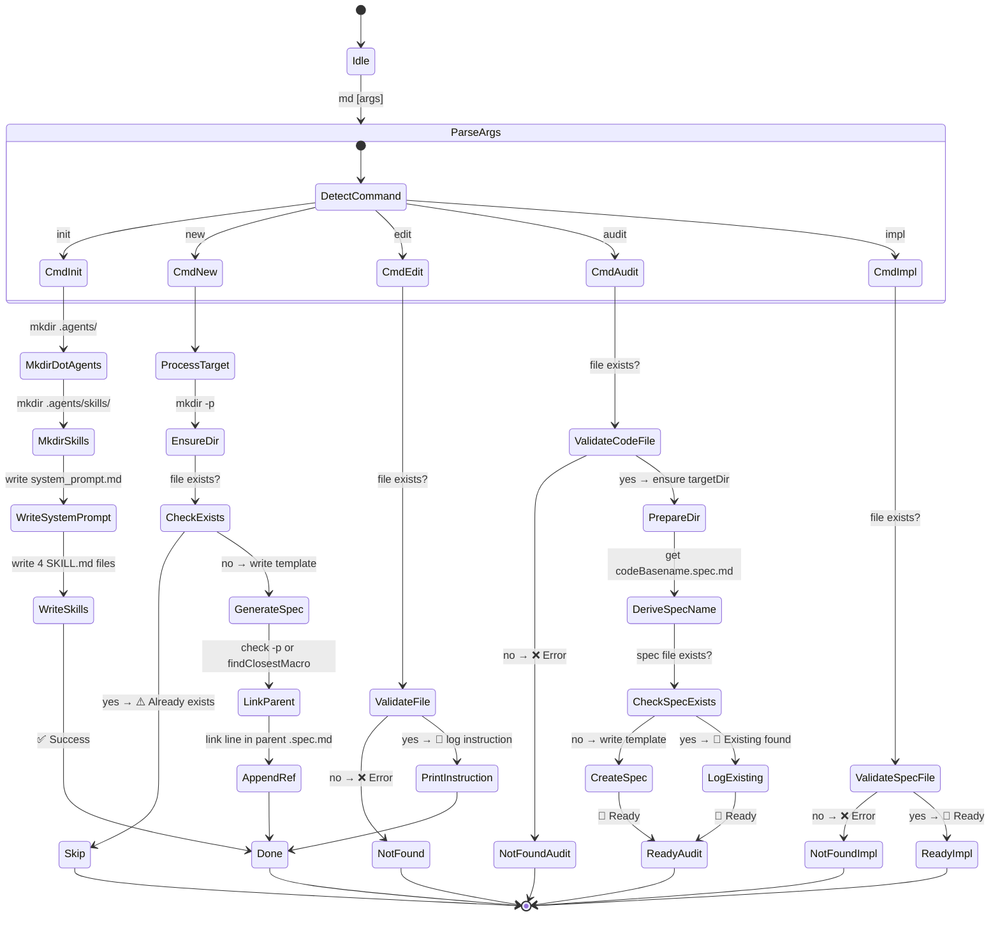
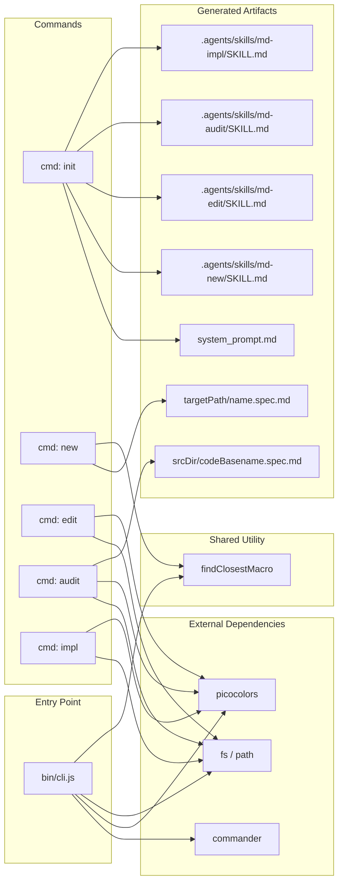

# CLI: mddd-cli | v1.3.0

## 1. Flow Contract (Mermaid)

## 2. Decision Matrix

### 2.1 Command Routing

| Input Pattern | Command | Action | Output |
| :--- | :--- | :--- | :--- |
| `md init` | `init` | Create `.agents/` + `system_prompt.md` + 4 skill files | ✅ Created / ✅ Already exists |
| `md new <path>` | `new` | Create co-located `.spec.md` at path; optional parent linking | ✅ Created / ⚠️ Exists / ❌ Error |
| `md edit <file> <msg>` | `edit` | Validate file, print instruction to stdout | 📝 Ready / ❌ Not found |
| `md audit <file>` | `audit` | Validate code file, create/co-locate `.spec.md` for audit output | 🚀 Ready / ❌ Not found |
| `md impl <file>` | `impl` | Validate spec file exists | 🚀 Ready / ❌ Not found |

### 2.2 `init` Command — File Generation

| Condition | Action | Next State |
| :--- | :--- | :--- |
| `./.agents` does not exist | `mkdir .agents` | Continue |
| `./.agents/skills` does not exist | `mkdir .agents/skills` | Continue |
| Always | Write `system_prompt.md` | Continue |
| For each skill (`md-new`, `md-edit`, `md-audit`, `md-impl`) | Create folder + `SKILL.md` | Continue → Done |
| Skill `SKILL.md` already exists | Overwrite silently via `fs.writeFileSync` | Replace |

### 2.3 `new` Command — Parent Linking

| Condition | Action | Next State |
| :--- | :--- | :--- |
| `--parent` provided AND file exists | Append link line to parent | ✅ Linked |
| `--parent` provided AND file NOT found | `process.exit(1)` with error | ❌ Fatal |
| `--parent` NOT provided | Auto-search via `findClosestMacro()` | ✅ Linked (if found) / No link (if none) |

### 2.4 `audit` Command — Spec File Generation

| Condition | Action | Next State |
| :--- | :--- | :--- |
| Code file does not exist | `process.exit(1)` with error | ❌ Fatal |
| Code file exists, target dir does not exist | `mkdir -p <targetDir>` | Continue |
| Code file exists, target dir exists | No action | Continue |
| Co-located `.spec.md` does NOT exist | Write template with `# Audit: <basename> | v1.0.0` | ⚡ Ready |
| Co-located `.spec.md` already exists | Log `📄 Existing specification found` | ⚡ Ready |
| Always after file ready | Print instruction: AI writes analysis into `
` in `.spec.md` | 🚀 Ready |

### 2.5 `findClosestMacro(currentDir)` — Traversal Logic

| Condition | Action | Return |
| :--- | :--- | :--- |
| Current dir contains `*.spec.md` (excluding current dir's own spec) | Return full path to that file | Path string |
| No matching file in current dir | Move to parent directory | Recurse |
| Reaches filesystem root (e.g., `/`) | Return `null` | `null` |
| `fs.readdirSync` throws (permission denied) | `break` out of loop | `null` |

## 3. Architecture Notes

- **Entry point**: `bin/cli.js` (referenced in `package.json` as `"bin": {"md": "bin/cli.js"}`)
- **Dependencies**: `commander` (argument parsing), `picocolors` (terminal coloring)
- **Runtime**: Node.js >= 18 (ESM — `"type": "module"`)
- **Pattern**: Each command is a self-contained `.action()` callback. Shared utility (`findClosestMacro`) is a module-level function with clear single responsibility.
- **Error handling**: Consistent pattern — validate file existence early, exit with code 1 + red message on failure, green/blue/yellow for success/warnings.
- **`md audit` spec generation**: The audit command derives the spec file name by stripping the code file extension and appending `.spec.md` (e.g., `user.go` → `user.spec.md`). The generated template includes a Decision Matrix, a placeholder Mermaid diagram, and an Audit History `
` section where the AI writes its full analysis.

## 4. Audit History

Click to expand

| Date | Auditor | Version | Notes |
| :--- | :--- | :--- | :--- |
| 2026-05-26 | AI (MDDD audit) | v1.0.0 | Initial spec: code is modular, cohesive, clean. Mapped as-is. |
| 2026-05-26 | AI (MDDD audit) | v1.1.0 | Deep audit of `bin/cli.js` source code. Code is clean and modular — mapped as-is (architecture diagram below). |
| 2026-05-26 | AI (MDDD audit) | v1.2.0 | Re-audit `bin/cli.js` v1.0.10 vs spec v1.1.0. Minor divergences found in `init` flow granularity and `new` guard logic. Spec updated to reflect real code. |
| 2026-05-26 | AI (MDDD audit) | v1.3.0 | `md audit` now auto-creates/co-locates `[basename].spec.md` for AI audit output. Skill `md-audit` updated to instruct AI to write analysis into that file. |

### Audit Report: `bin/cli.js` (2026-05-26)

**Target**: `bin/cli.js` — CLI entry point (v1.0.8)

**Complexity Analysis**:

| Metric | Assessment |
| :--- | :--- |
| Total lines | ~250 |
| Commands | 5 (`init`, `new`, `edit`, `audit`, `impl`) |
| Shared utilities | 1 (`findClosestMacro`) |
| External deps | 3 (`commander`, `picocolors`, `fs`/`path` native) |
| Cyclomatic complexity | Low — each action is linear with early-exit guards |
| Coupling | Low — standalone CLI, no cross-module dependencies |
| Testability | Medium — `process.exit()` scattered across callbacks hinders unit testing |
| Business rule clarity | High — each `.action()` maps 1:1 to the Decision Matrix rows |

**Structural Observations**:
1. ✅ **Cohesion**: Each command maps to a single responsibility. No cross-command shared state.
2. ✅ **Error handling**: Consistent pattern — validate → exit with colored message.
3. ✅ **Single Source of Truth alignment**: Code follows the spec's Decision Matrix exactly. No undocumented logic.
4. ⚠️ **`skills` object** (~80 lines inline in `init` action): For future growth, extract to `skills/` JSON files.
5. ⚠️ **Template strings** in `new` action: Extract to `templates/` directory for maintainability.
6. ⚠️ **`process.exit()` scattering**: If this grows into a library, consider centralizing error handling and returning exit codes.

### Audit Report: `bin/cli.js` (2026-05-26) — v1.2.0 Re-audit

**Target**: `bin/cli.js` — CLI entry point (v1.0.10)

**Discrepancies Found vs Spec v1.1.0**:

| Item | Spec Said | Code Does | Verdict |
| :--- | :--- | :--- | :--- |
| `init` flow — directory creation | `CreateDotAgents: mkdir .agents/skills/` | Two separate conditional mkdir: `mkdir .agents/` then `mkdir .agents/skills/` | ⚠️ Minor — spec combined into one state; fixed in v1.2.0 diagram |
| `init` — SKILL.md overwrite | "Delete old, write new" | `fs.writeFileSync` overwrites silently, no deletion | ⚠️ Minor — wording fixed in v1.2.0 matrix |
| `new` — `CheckExists` guard order | CheckExists branches to Skip or GenerateSpec | Code checks `fs.existsSync(normalizedPath)` for mkdir, then checks `fs.existsSync(finalFile)` separately | ✅ Correct — diagram simplified, no semantic error |
| `new` — trailing slash normalization | Not mentioned | `normalizedPath` uses `.replace(/[\\/]+$/, '')` | ✅ Enhancement — documented below |
| `findClosestMacro` — dir exclusion | Not specified | Excludes file named `${path.basename(currentDir)}.spec.md` | ✅ Enhancement — documented in matrix |
| Version metadata | N/A (spec refers to v1.0.8) | Code declares `v1.0.10` | ✅ Cosmetic — spec now at v1.2.0 |

**Newly Documented Behaviors**:
- **Trailing slash cleanup**: `path.normalize(targetPath).replace(/[\\/]+$/, '')` strips trailing slashes before mkdir.
- **Self-exclusion in `findClosestMacro`**: The macro search excludes `${path.basename(currentDir)}.spec.md` to avoid matching the directory's own spec file.
- **Permission-denied break**: On `EACCES`/`EPERM`, the loop breaks and returns `null`. All other `fs.readdirSync` errors are rethrown.

**Architecture Diagram (Current State — v1.0.10)**:

