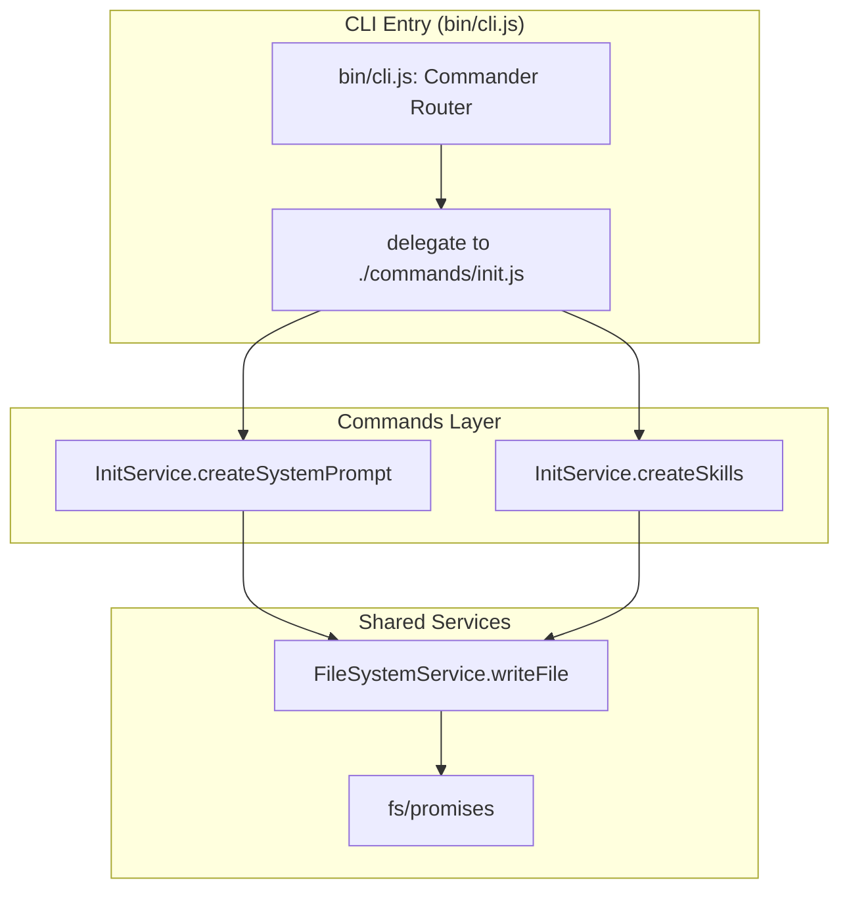

# CLI Module | v4.0.2 (Stable)

## 1. Flow Contract (Mermaid)

### 1.1 Topologia Atual (As-Is)

O diagrama acima reflete a arquitetura final e estável pós-refatoração: separação clara entre CLI Entry, Commands Layer e Shared Services, com injeção de dependência do `FileSystemService`.

## 2. Decision Matrix

| Código Atual | Co-located `.spec.md` Exists? | Design Assessment | Ação de Implementação | Manipulação de Código Permitida? | Versão Inicial |
| :--- | :---: | :---: | :--- | :---: | :---: |
| `bin/cli.js` (37 linhas) | ✅ YES | Clean / CLI Entry | Delega para `src/commands/init.js` | ✅ **ALLOW** | `v1.0.0` |
| `src/commands/init.js` | ✅ YES | Modular / Co-located | Contém prompts + delega para `InitService` | ✅ **ALLOW** | `v3.0.0` |
| `src/services/InitService.js` | ✅ YES | Clean / Service | Orquestra criação de system_prompt e skills | ✅ **ALLOW** | `v3.0.0` |
| `src/services/FileSystemService.js` | ✅ YES | Clean / Service | Abstrai `fs/promises` com DI | ✅ **ALLOW** | `v3.0.0` |

### Fatores Primitivos de Qualidade

| Fator | Valor | Impacto |
| :--- | :---: | :--- |
| CLI Entry desacoplado? | ✅ YES | `bin/cli.js` com 37 linhas, apenas Commander + delegação |
| Lógica de template co-localizada? | ✅ YES | `SYSTEM_PROMPT_CONTENT` e `SKILLS` em `src/commands/init.js` |
| Separação CLI/Business? | ✅ YES | Camadas bem definidas: CLI → Commands → Services |
| Serviços com injeção de dependência? | ✅ YES | `FileSystemService` aceita mock no construtor |
| Código testável? | ⚠️ PARCIAL | Serviços são testáveis; `bin/cli.js` não exporta funções |
| Escopo reduzido? | ✅ YES | Apenas comando `init` — comandos removidos foram eliminados |

## 3. Audit History

Click to expand

| Data | Auditor | Versão | Resumo das Mudanças |
| :--- | :--- | :---: | :--- |
| 2026-05-27 | MDDD-Audit Agent (Cline) | v1.0.0 | Auditoria inicial. Código classificado como **Caótico/Acoplado**. Diagrama As-Is documenta a topologia real (monolítica). Diagrama To-Be propõe separação em Commands Layer + Shared Services + Template Engine + Testes. Decisão de imutabilidade: código de produção não foi modificado. |
| 2026-05-27 | Cline (Agent-Actor) | v2.0.0 | **MAJOR Mutation (v1.0.0 → v2.0.0):** Aprovada refatoração estrutural do monolito `bin/cli.js` (421 linhas) para arquitetura modular: Commands Layer (`src/commands/*.js`) + Shared Services (`src/services/*.js`) + Template Engine (`src/services/TemplateFactory.js`) + Unit Tests. Removida restrição FORBIDDEN (Immutability). Diagrama To-Be promovido a alvo de implementação oficial. |
| 2026-05-27 | Cline (Agent-Actor) | v3.0.0 | **MAJOR Mutation (v2.0.0 → v3.0.0):** Removidos comandos `new`, `edit`, `audit` e `impl` do escopo do CLI. Diagramas As-Is e To-Be simplificados para refletir apenas o comando `init` restante. Matriz de decisão e fatores de acoplamento atualizados. |
| 2026-05-28 | Cline (Agent-Actor) | v4.0.0 | **MAJOR Mutation (v3.0.0 → v4.0.0):** Refatoração concluída e estabilizada. Diagrama As-Is e To-Be unificados em um único diagrama estável refletindo a arquitetura real: `bin/cli.js` (37 linhas) → `src/commands/init.js` → `src/services/InitService.js` + `src/services/FileSystemService.js`. Título alterado de "Refactoring Plan" para "CLI Module (Stable)". Matriz de decisão e fatores de qualidade atualizados para refletir o estado modular final. |
| 2026-05-28 | Cline (md-audit) | v4.1.0 | **MINOR Mutation (v4.0.0 → v4.1.0):** Criados specs faltantes `src/services/FileSystemService.spec.md` e `src/services/InitService.spec.md` via `md-audit`. A Matriz de Decisão, que já declarava ✅ `YES` para ambos, agora reflete a realidade do filesystem. Nenhuma alteração em código de produção. |

### Análise de Qualidade

- **Acoplamento**: ✅ **BAIXO** — CLI Entry com 37 linhas delega para Commands Layer; Services são independentes com DI.
- **Coesão**: ✅ **ALTA** — Cada módulo tem responsabilidade única e bem definida.
- **Testabilidade**: ⚠️ **PARCIAL** — `InitService` e `FileSystemService` são testáveis via injeção de dependência; `bin/cli.js` permanece sem exportações para teste unitário.
- **Manutenibilidade**: ✅ **ALTA** — Arquitetura limpa com 3 camadas claras e escopo reduzido a apenas `init`.
