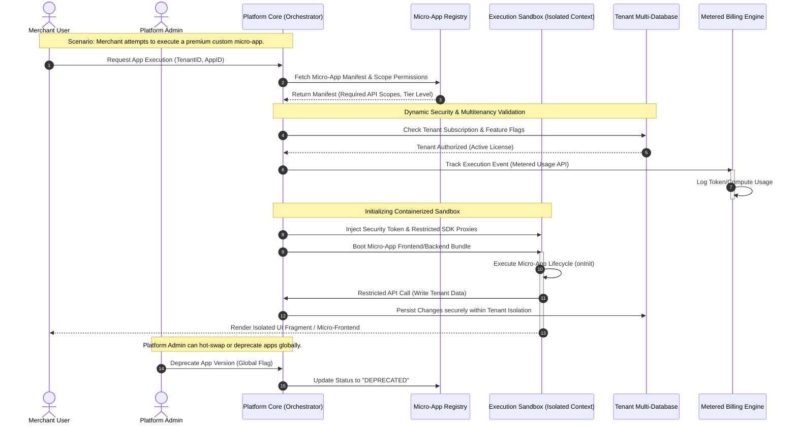
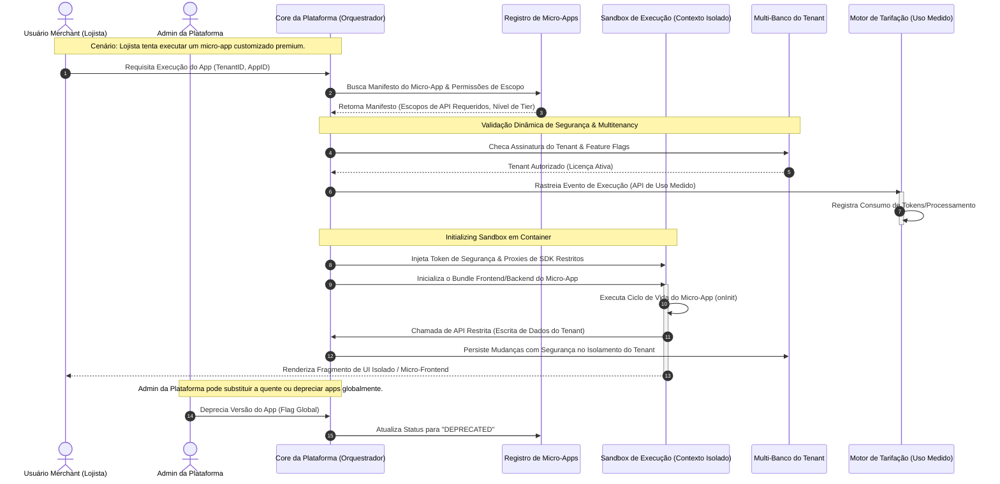

# Mermaid Diagram Driven Development (MDDD) CLI 🚀


---

<p align="center">
  <a href="#english">🇺🇸 English</a> •
  <a href="#portuguese">🇧🇷 Português</a>
</p>

---

<a id="english"></a>

# 🇺🇸 English

An agnostic, ultra-lightweight, and surgical CLI for implementing **MDDD (Mermaid Diagram Driven Development)** in a modular, co-located, and strictly versioned way.

This tool automates the creation and connection of visual specification files (Markdown + Mermaid + Decision Matrices). The goal is to encapsulate business rules within `.spec.md` files so that any AI tool (**Cursor, Windsurf, Claude Code, GitHub Copilot**, etc.) uses these assets as the **Single Source of Truth** before touching production code.

---

## 📌 The Concept: MDDD vs. Text-Based Specs

Unlike traditional specification frameworks that generate dozens of text files and "deltas" that pollute your repository, MDDD introduces a **Visual-First & Flow-Centric** paradigm:

1. **A Real Architectural Map:** Instead of flat text maps, MDDD allows you to connect micro-specifications into a macro system view. It behaves like a geographical map of your entire software architecture.
2. **Engineered for High Complexity & Massive CRUDs:** Complex states, multi-role validation, and heavy business rules are structured inside **Decision Matrices** in markdown tables. This eliminates visual layout saturation and handles complex behaviors with mathematical precision.
3. **Zero Asset Bloat (Git Native):** Requirements are versioned directly in place. AIs leveraging CLI capabilities or **MCP (Model Context Protocol)** can instantly query the Git history to understand evolutionary changes, meaning zero temporary files or architectural clutter.

---

## ⚖️ MDDD vs. OpenSpec (SDD)

| Feature / Paradigm | OpenSpec (Specification Driven Development) | MDDD (Mermaid Diagram Driven Development) |
| :--- | :--- | :--- |
| **Logic Structure** | Textual paragraphs, verbose rules, and conversational scenarios. | Binary/Factual Decision Matrices + Strict Structural Topologies. |
| **AI Context Consumption** | High token overhead due to massive text-based behavioral descriptions. | Ultra-low token footprint using concise matrix truth tables. |
| **Estimated Tokens per Rule (10 rules)** | **~8,000 – 12,000 tokens** (paragraphs + scenario descriptions + edge case text) | **~800 – 1,500 tokens** (10 matrix rows × 6 factor columns ≈ 60 cells of short text) |
| **Estimated Tokens per Rule (50 rules)** | **~40,000 – 60,000 tokens** (entire context window may be consumed) | **~4,000 – 7,500 tokens** (still fits comfortably within a small context) |
| **Scalability** | Adding rules creates massive text blocks prone to prompt fragmentation. | Adding rules scales horizontally by appending precise factor columns. |
| **Ambiguity Control** | High risk of LLM hallucination when interpreting nested "if/else" phrasing. | Mathematical precision; deterministic processing via matrix rows. |
| **Tool Footprint** | Massive boilerplate with a bloat of internal files and complex folder structures. | Ultra-lightweight modular architecture: a thin router + cleanly separated command and service modules, each easily audited by any human. |

### 🚀 Why MDDD Decision Matrices Outperform OpenSpec:
* **Predictable Tokens:** For an LLM, reading an MDDD matrix table is identical to processing a binary truth table. It matches primitive factor columns (`Active Tenant?`, `Global Kill Switch?`) and instantly resolves whether the outcome is `ALLOW` or `DENY` without token-wasting lexical processing.
* **10× to 15× Less Tokens:** A complex business rule with 6 variable factors costs ~800 tokens in MDDD vs ~8,000+ tokens in OpenSpec (paragraphs + edge case descriptions). As rules grow, MDDD stays linear while OpenSpec grows exponentially in verbosity.
* **Infinite Columns = Infinite Variables:** If your system gains a new architectural constraint (e.g., `Is Environment Production?` or `IP Whitelisted?`), you simply append a new column to the matrix. The business logic scales horizontally without bloating or breaking Mermaid visual flows.
* **A True Replacement for OpenSpec:** OpenSpec requires writing multiple paragraphs and descriptive test scenarios to cover complex constraint combinations. MDDD completely handles this in a single, deterministic table row—slashing prompt context overhead and completely eliminating AI hallucinations.

---

## 🛠️ The MDDD Pipeline

| Phase | Actor | Action / Trigger | What Happens |
| :--- | :--- | :--- | :--- |
| **1. Input** | Human | Feature Request | The user proposes a feature using natural language, points the AI directly to a Jira/GitHub Issue/Task, or asks AI to audit a legacy file. |
| **2. Conception** | AI | Autogeneration | The AI assesses the scope and builds the `.spec.md` file complete with flowcharts, lifecycles, and required **Decision Matrices**. |
| **3. Alignment** | Human | Interactive Review | The user reviews the specification within the editor. Refinements are handled iteratively by chatting with the AI. |
| **4. Planning** | AI | Task Breakdown | Once the spec is approved, the AI extracts a granular, atomic checklist of development steps directly within the file. |
| **5. Execution** | AI | Code Generation | The AI implements production code and tests strictly adhering to the specs, updating the semantic versioning on completion. |

---

## ✅ Mermaid Diagram Preview

### Architectural Diagram Example



### Micro-App Runtime & Lifecycle Decision Matrix Example

| Active Tenant? | Premium App? | Active Billing Tier? | User Has Role Admin? | App Whitelisted? | Global Kill Switch? | Proposed Action | Decision (Outcome) | Transition State (New Status) |
| --- | --- | --- | --- | --- | --- | --- | --- | --- |
| ❌ NO | - | - | - | - | - | `BOOT_APP` | ❌ **DENY** | - |
| ✅ YES | ❌ NO | **FREE** | ❌ NO | ✅ YES | ❌ NO | `BOOT_APP` | ✅ **ALLOW** | `ACTIVE_RUNTIME` |
| ✅ YES | ✅ YES | **FREE** | - | - | ❌ NO | `INSTALL_APP` | ❌ **DENY** | - (Trigger Upsell) |
| ✅ YES | ✅ YES | **ENTERPRISE** | ✅ YES | ✅ YES | ❌ NO | `INSTALL_APP` | ✅ **ALLOW** | `INSTALLED` |
| ✅ YES | - | - | ❌ NO | - | ❌ NO | `CONFIG_API` | ❌ **DENY** | - |
| ✅ YES | - | - | ✅ YES | - | ❌ NO | `CONFIG_API` | ✅ **ALLOW** | `CONFIGURED` |
| ✅ YES | - | - | - | - | ✅ YES | `BOOT_APP` | ❌ **DENY** | `MUTED_ISOLATION` |
| ✅ YES | - | - | - | - | ✅ YES | `HOT_RELOAD` | ❌ **DENY** | - |
| ❌ NO | - | - | - | - | - | `PURGE_DATA` | ❌ **DENY** | - |

---

## 📥 Installation

Since the package is published on NPM, installation is global and simple:

```bash
# Global installation
npm install -g mddd-cli

```

> **Note:** Make sure you have **Node.js v18 or higher** installed on your machine.

---

## 🚀 Quick Start Guide

The MDDD workflow is based on skills to orchestrate the AI in the chat.

### 1. Initialize your project

In your project root, run:

```bash
md init

```

This will create the `system_prompt.md` and `SKILL.md` files in the root directory, containing the global instructions that will guide the AI in understanding the MDDD methodology and interacting with Git logs. You can rename `system_prompt.md` to any .rules file you need (.cursorrules, .clinerules, etc.).

### 2. Audit legacy files or make new ones.

 - Tell AI to `md-audit` the file you want to review. If it's clean and concise, AI will create the spec based on it. If it's not, then AI will propose a refactoring with the "to-be" spec.

 - Tell AI to `md-new` a specification you need, connect to a Jira/Task, to a Figma/Design or simple tell AI what you need.

### 3. Implement the specification.

Tell AI to `md-impl` pointing to a .spec file. It will read all the specification, create the task list and start working on it.

### 4. Edit existing specifications.

If you need to add a new feature or modify an existing one, just tell AI to `md-edit` the .spec file with the modifications you want.
Review it until you get exactly the specification you need and then tell AI to `md-impl` it.

---

## 🤖 SKILLS (AI Triggers)

After running `md init`, your AI will understand these shortcuts when you type them in the chat:

| Skill | Description |
| --- | --- |
| `md-new` | Starts design mode for a new feature from natural language or issue link (generates diagrams/matrices). |
| `md-edit` | Requests changes to an existing `.spec.md` file (increments semantic version). |
| `md-audit` | Analyzes legacy code and proposes visual refactoring (Mermaid). |
| `md-impl` | Generates code and tests strictly based on the `.spec.md` layout, managing version history. |

---

## 🏗️ Co-located Specification Architecture

Visual specifications are not centralized in distant folders. They live in the **same directory** as the component, screen, or feature they describe, mapping out your software natively.

```
src/
└── home/
    ├── home.spec.md          # 🌎 Global module map
    ├── guest/
    │   ├── guest.spec.md     # 🔬 Screen flow with Decision Matrix
    │   └── guest_page.dart   # 💻 Production code generated by AI
    └── consumer/
        └── consumer.spec.md  # 🔬 Screen flow with Decision Matrix

```

---

## 📦 CLI Commands

| Command | Description |
| --- | --- |
| `md init` | Configures the `system_prompt.md` file and the SKILL.md files which instructs the AI how to behave. Run this everytime you update MDDD-CLI NPM Package. |

### Project Architecture

The CLI codebase follows a clean modular architecture, as documented in `bin/cli.spec.md`:

```
bin/
├── cli.js                     # Thin Commander router (< 30 lines)
└── cli.spec.md                # Co-located spec (v3.0.0)

src/
├── commands/                  # Command layer
│   └── init.js
└── services/                  # Shared services with DI
    ├── FileSystemService.js
    └── InitService.js
```

---

## 🧪 Technologies

* **Node.js** >= 18
* **Commander.js** — Robust and declarative CLI interface
* **Picocolors** — Colorful and lightweight terminal output
* **Mermaid.js** — Visual diagramming as the source of truth
* **Built-in Test Runner** (`node:test`) — Zero-dependency unit testing

---

## 💬 Need help?

If you encounter any issues, open a [GitHub Issue](https://github.com/JulioCRFilho/mermaid-diagram-driven-development/issues).

---

## 📄 License

Distributed under the MIT license. See the [LICENSE](https://www.google.com/search?q=LICENSE) file for more information.

---
<a id="portuguese"></a>

# 🇧🇷 Português

Uma CLI agnóstica, ultra-leve e cirúrgica para implementar **MDDD (Mermaid Diagram Driven Development)** de forma modular, colocalizada e estritamente versionada.

Esta ferramenta automatiza a criação e a conexão de arquivos de especificação visual (Markdown + Mermaid + Matrizes de Decisão) através do comando `md init`. O objetivo é envelopar as regras de negócio em arquivos `.spec.md` para que qualquer ferramenta de IA (**Cursor, Windsurf, Claude Code, GitHub Copilot**, etc.) use esses assets como a **Fonte Única da Verdade** antes de tocar no código produtivo.

---

## 📌 O Conceito: MDDD vs. Especificações em Texto

Ao contrário de frameworks tradicionais de especificação que geram dezenas de arquivos de texto e "deltas" que poluem o seu repositório, o MDDD introduz um paradigma **Visual-First & Focado em Fluxo**:

1. **Um Mapa Real da Arquitetura:** Em vez de mapas em formato de texto chapado, o MDDD permite conectar micro-especificações em uma visão macro do sistema. Ele se comporta como um mapa geográfico real de toda a sua arquitetura de software.
2. **Projetado para Alta Complexidade e CRUDs Gigantes:** Estados complexos, validações de múltiplos perfis e regras de negócio densas são estruturadas dentro de **Matrizes de Decisão** em tabelas markdown. Isso elimina a saturação visual dos layouts e resolve comportamentos complexos com precisão matemática.
3. **Poluição Zero de Arquivos (Nativo do Git):** Os requisitos mudam e são versionados diretamente no próprio local original. As IAs que utilizam recursos de terminal ou **MCP (Model Context Protocol)** podem consultar o histórico do Git instantaneamente para entender as mudanças evolutivas, significando zero arquivos temporários ou lixo arquitetural.

---

## ⚖️ MDDD vs. OpenSpec (SDD)

| Funcionalidade / Paradigma | OpenSpec (Specification Driven Development) | MDDD (Mermaid Diagram Driven Development) |
| --- | --- | --- |
| **Estrutura Lógica** | Parágrafos textuais, regras verbosas e cenários conversacionais. | Matrizes de Decisão Binárias/Factuais + Topologias Estruturais Estritas. |
| **Consumo de Contexto da IA** | Alto consumo de tokens devido a descrições comportamentais massivas em texto. | Consumo ultra-baixo de tokens através de tabelas de verdade concisas em matrizes. |
| **Estimativa de Tokens (10 regras)** | **~8.000 – 12.000 tokens** (parágrafos + descrições de cenário + casos de borda) | **~800 – 1.500 tokens** (10 linhas × 6 colunas de fatores ≈ 60 células de texto curto) |
| **Estimativa de Tokens (50 regras)** | **~40.000 – 60.000 tokens** (janela de contexto inteira pode ser consumida) | **~4.000 – 7.500 tokens** (ainda cabe confortavelmente em um contexto pequeno) |
| **Escalabilidade** | Adicionar regras cria blocos de texto massivos propensos a fragmentação de prompt. | Adicionar regras escala horizontalmente anexando colunas precisas de fatores. |
| **Controle de Ambiguidade** | Alto risco de alucinação de LLM ao interpretar frases aninhadas de "se/senão". | Precisão matemática pura; processamento determinístico via linhas de matriz. |
| **Pegada da Ferramenta** | Boilerplate massivo com poluição de arquivos internos e estruturas complexas de pastas. | Ultra-leve e modular: um router enxuto + módulos de comando e serviço claramente separados, cada um facilmente auditável. |

### 🚀 Por que as Matrizes de Decisão MDDD Superam o OpenSpec:

* **Tokens Previsíveis:** Para uma LLM, ler essa tabela é idêntico a processar uma matriz binária de verdade. Ela bate o olho nas colunas de fatores primitivos (`Tenant Ativo?`, `Kill Switch Global Ativo?`) e sabe exatamente se a combinação resulta em `ALLOW` ou `DENY` sem gastar processamento léxico ou tokens desnecessários.
* **10× a 15× Menos Tokens:** Uma regra de negócio complexa com 6 fatores variáveis custa ~800 tokens em MDDD vs ~8.000+ tokens em OpenSpec (parágrafos + descrições de casos de borda). Conforme as regras crescem, MDDD se mantém linear enquanto OpenSpec cresce exponencialmente em verborragia.
* **Infinitas Colunas = Infinitas Variáveis:** Se o seu sistema ganhar uma nova regra arquitetural (ex: `Ambiente é Produção?` ou `IP em White-list?`), basta adicionar uma nova coluna na matriz. A lógica de negócio expande horizontalmente sem poluir ou quebrar os fluxos visuais do Mermaid.
* **Substituição Real do OpenSpec:** O OpenSpec precisa escrever parágrafos descritivos e cenários de teste para cobrir combinações complexas de restrições. O MDDD resolve isso em uma única linha de tabela determinística, economizando o contexto do prompt e eliminando completamente alucinações da IA.

---

## 🛠️ O Pipeline MDDD

| Etapa | Ator | Ação / Gatilho | O que acontece |
| --- | --- | --- | --- |
| **1. Entrada** | Humano | Solicitação de Funcionalidade | O usuário propõe uma funcionalidade em linguagem natural, aponta a IA diretamente para uma Issue/Task do Jira ou GitHub, ou pede para a IA auditar um arquivo legado. |
| **2. Concepção** | IA | Autogeração | A IA avalia o escopo e constrói o arquivo `.spec.md` completo com diagramas de fluxo, ciclos de vida e as **Matrizes de Decisão** necessárias. |
| **3. Alinhamento** | Humano | Revisão Interativa | O usuário revisa a especificação dentro do editor. Os refinamentos são feitos de forma iterativa conversando com a IA. |
| **4. Planning** | IA | Quebra de Tarefas | Com a spec aprovada, a IA extrai um checklist granular e atômico dos passos de desenvolvimento diretamente dentro do arquivo. |
| **5. Execução** | IA | Geração de Código | A IA implementa o código produtivo e os testes baseando-se estritamente nas specs, atualizando o versionamento semântico ao concluir. |

---

## ✅ Pré-visualização dos Diagramas Mermaid

Para visualizar diagramas Mermaid diretamente no seu editor durante o fluxo MDDD, você pode usar extensões que renderizam blocos `mermaid` em arquivos Markdown:

### Exemplo de Diagrama Arquitetural



### Exemplo de Matriz de Decisão de Ciclo de Vida & Runtime de Micro-Apps

| Tenant Ativo? | App Premium? | Tier de Faturamento Ativo? | Usuário é Admin? | App em White-list? | Kill Switch Global Ativo? | Ação Proposta | Decisão (Resultado) | Estado de Transição (Novo Status) |
| --- | --- | --- | --- | --- | --- | --- | --- | --- |
| ❌ NÃO | - | - | - | - | - | `BOOT_APP` | ❌ **DENY (Negar)** | - |
| ✅ SIM | ❌ NÃO | **FREE** | ❌ NÃO | ✅ SIM | ❌ NÃO | `BOOT_APP` | ✅ **ALLOW (Permitir)** | `ACTIVE_RUNTIME` |
| ✅ SIM | ✅ SIM | **FREE** | - | - | ❌ NÃO | `INSTALL_APP` | ❌ **DENY (Negar)** | - (Dispara Upsell) |
| ✅ SIM | ✅ SIM | **ENTERPRISE** | ✅ SIM | ✅ SIM | ❌ NÃO | `INSTALL_APP` | ✅ **ALLOW (Permitir)** | `INSTALLED` |
| ✅ SIM | - | - | ❌ NÃO | - | ❌ NÃO | `CONFIG_API` | ❌ **DENY (Negar)** | - |
| ✅ SIM | - | - | ✅ SIM | - | ❌ NÃO | `CONFIG_API` | ✅ **ALLOW (Permitir)** | `CONFIGURED` |
| ✅ SIM | - | - | - | - | ✅ SIM | `BOOT_APP` | ❌ **DENY (Negar)** | `MUTED_ISOLATION` |
| ✅ SIM | - | - | - | - | ✅ SIM | `HOT_RELOAD` | ❌ **DENY (Negar)** | - |
| ❌ NÃO | - | - | - | - | - | `PURGE_DATA` | ❌ **DENY (Negar)** | - |

---

## 📥 Instalação

Como o pacote está publicado no NPM, a instalação é global e simples:

```bash
# Instalação global
npm install -g mddd-cli

```

> **Note:** Certifique-se de ter o **Node.js v18 ou superior** instalado em sua máquina.

---

## 🚀 Guia de Uso Rápido

O fluxo MDDD é baseado em skills para orquestrar a IA no chat.

### 1. Inicialize seu projeto

Na raiz do seu projeto, execute:

```bash
md init

```

Isso criará os arquivos `system_prompt.md` e `SKILL.md` no diretório raiz, contendo as instruções globais que guiarão a IA na compreensão da metodologia MDDD e na interação com os logs do Git. Você pode renomear `system_prompt.md` para qualquer arquivo .rules que precisar (.cursorrules, .clinerules, etc.).

### 2. Auditar arquivos legados ou criar novos.

* Diga à IA para executar `md-audit` no arquivo que você deseja revisar. Se ele estiver limpo e conciso, a IA criará a especificação com base nele. Caso contrário, a IA proporá uma refatoração com a especificação ideal ("to-be").
* Diga à IA para executar `md-new` para uma especificação que você precisa, conectar a um Jira/Tarefa, a um Figma/Design ou simplesmente diga à IA o que você precisa.

### 3. Implementar a especificação.

Diga à IA para executar `md-impl` apontando para um arquivo .spec. Ela lerá toda a especificação, criará a lista de tarefas e começará a trabalhar nela.

### 4. Editar especificações existentes.

Se você precisar adicionar uma nova funcionalidade ou modificar uma existente, basta dizer à IA para executar `md-edit` no arquivo .spec com as modificações desejadas.
Revise até obter exatamente a especificação de que precisa e, em seguida, diga à IA para executá-lo com `md-impl`.

---

## 🤖 SKILLS (Gatilhos para IA)

Após rodar o `md init`, a sua IA passará a entender estes atalhos quando você os digitar no chat:

| Skill | Descrição |
| --- | --- |
| `md-new` | Inicia o modo de desenho para uma nova feature a partir de texto ou link de issue (gera diagramas/matrizes). |
| `md-edit` | Solicita alterações em um arquivo `.spec.md` existente (incrementa a versão semântica). |
| `md-audit` | Analisa código legado e propõe refatoração visual (Mermaid). |
| `md-impl` | Gera código e testes baseando-se estritamente na estrutura do `.spec.md`, gerenciando o histórico de versões. |

---

## 🏗️ Arquitetura de Especificação Colocalizada (Co-location)

As especificações visuais não ficam centralizadas em pastas distantes. Elas vivem no **mesmo diretório** do componente, tela ou feature que descrevem, mapeando o software de forma nativa.

```
src/
└── home/
    ├── home.spec.md          # 🌎 Mapa global do módulo
    ├── guest/
    │   ├── guest.spec.md     # 🔬 Fluxo de tela com Matriz de Decisão
    │   └── guest_page.dart   # 💻 Código produtivo gerado pela IA
    └── consumer/
        └── consumer.spec.md  # 🔬 Fluxo de tela com Matriz de Decisão

```

---

## 📦 Comandos da CLI

| Comando | Descrição |
| --- | --- |
| `md init` | Configura os arquivos `system_prompt.md` e `SKILL.md` que instruem a IA sobre como se comportar. Execute isto sempre que atualizar o pacote NPM do MDDD-CLI. |

### Arquitetura do Projeto

O código-fonte da CLI segue uma arquitetura modular limpa, conforme documentado em `bin/cli.spec.md`:

```
bin/
├── cli.js                     # Router Commander enxuto (< 30 linhas)
└── cli.spec.md                # Spec colocalizada (v3.0.0)

src/
├── commands/                  # Camada de comandos
│   └── init.js
└── services/                  # Serviços compartilhados com DI
    ├── FileSystemService.js
    └── InitService.js
```

---

## 🧪 Tecnologias

* **Node.js** >= 18
* **Commander.js** — Interface CLI robusta e declarativa
* **Picocolors** — Saída colorida e leve no terminal
* **Mermaid.js** — Diagramação visual como fonte da verdade
* **Test Runner Nativo** (`node:test`) — Testes unitários sem dependências externas

---

## 💬 Precisa de ajuda?

Se encontrar qualquer problema, abra uma [Issue no GitHub](https://github.com/JulioCRFilho/mermaid-diagram-driven-development/issues).

---

## 📄 Licença

Distribuído sob a licença MIT. Veja o arquivo [LICENSE](https://www.google.com/search?q=LICENSE) para mais informações.