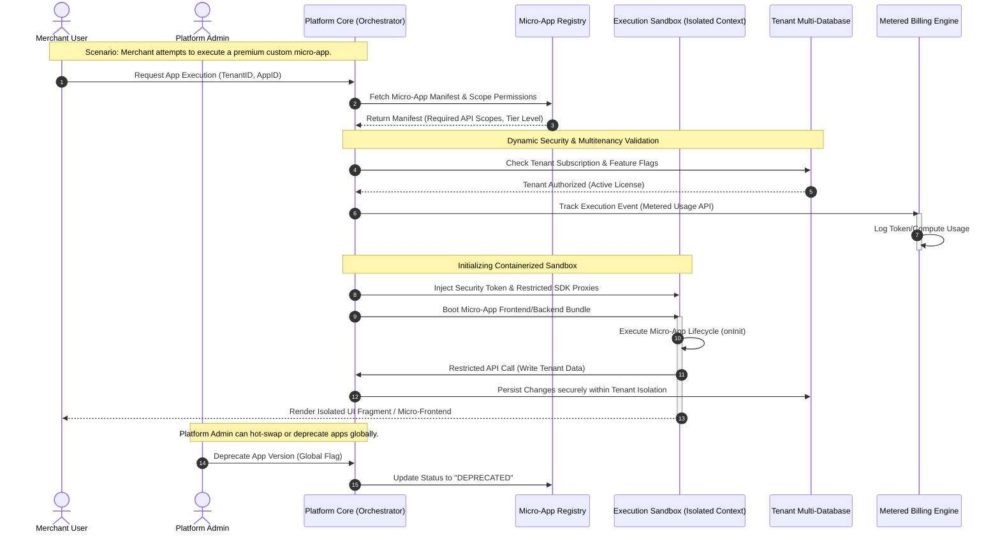
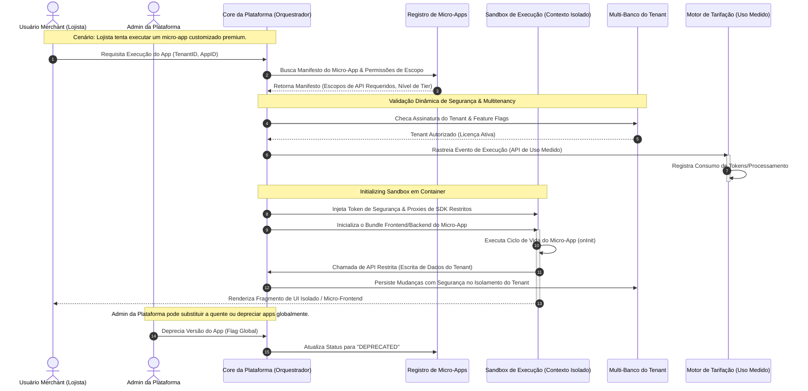

# Mermaid Diagram Driven Development (MDDD) CLI 🚀


---

<p align="center">
  <a href="#english">🇺🇸 English</a> •
  <a href="#português">🇧🇷 Português</a>
</p>

---

<a id="english"></a>

# 🇺🇸 English

An agnostic, ultra-lightweight, and surgical CLI for implementing **MDDD (Mermaid Diagram Driven Development)** in a modular, co-located, and strictly versioned way.

This tool automates the creation and connection of visual specification files (Markdown + Mermaid + Decision Matrices). The goal is to encapsulate business rules within `.spec.md` files so that any AI tool (**Cursor, Windsurf, Claude Code, GitHub Copilot**, etc.) uses these assets as the **Single Source of Truth** before touching production code.

---

## 📌 The Concept: MDDD vs. Text-Based Specs

Unlike traditional specification frameworks that generate dozens of text files and "deltas" that pollute your repository, MDDD introduces a **Visual-First & Flow-Centric** paradigm:

1. **A Real Architectural Map:** Instead of flat text maps, MDDD allows you to connect micro-specifications into a macro system view. It behaves like a geographical map of your entire software architecture.
2. **Engineered for High Complexity & Massive CRUDs:** Complex states, multi-role validation, and heavy business rules are structured inside **Decision Matrices** in markdown tables. This eliminates visual layout saturation and handles complex behaviors with mathematical precision.
3. **Zero Asset Bloat (Git Native):** Requirements are versioned directly in place. AIs leveraging CLI capabilities or **MCP (Model Context Protocol)** can instantly query the Git history to understand evolutionary changes, meaning zero temporary files or architectural clutter.

---

## ⚖️ MDDD vs. OpenSpec (SDD)

| Feature / Paradigm | OpenSpec (Specification Driven Development) | MDDD (Mermaid Diagram Driven Development) |
| :--- | :--- | :--- |
| **Logic Structure** | Textual paragraphs, verbose rules, and conversational scenarios. | Binary/Factual Decision Matrices + Strict Structural Topologies. |
| **AI Context Consumption** | High token overhead due to massive text-based behavioral descriptions. | Ultra-low token footprint using concise matrix truth tables. |
| **Scalability** | Adding rules creates massive text blocks prone to prompt fragmentation. | Adding rules scales horizontally by appending precise factor columns. |
| **Ambiguity Control** | High risk of LLM hallucination when interpreting nested "if/else" phrasing. | Mathematical precision; deterministic processing via matrix rows. |
| **Tool Footprint** | Massive boilerplate with a bloat of internal files and complex folder structures. | Ultra-lightweight modular architecture: a thin router + cleanly separated command and service modules, each easily audited by any human. |

### 🚀 Why MDDD Decision Matrices Outperform OpenSpec:
* **Predictable Tokens:** For an LLM, reading an MDDD matrix table is identical to processing a binary truth table. It matches primitive factor columns (`Active Tenant?`, `Global Kill Switch?`) and instantly resolves whether the outcome is `ALLOW` or `DENY` without token-wasting lexical processing.
* **Infinite Columns = Infinite Variables:** If your system gains a new architectural constraint (e.g., `Is Environment Production?` or `IP Whitelisted?`), you simply append a new column to the matrix. The business logic scales horizontally without bloating or breaking Mermaid visual flows.
* **A True Replacement for OpenSpec:** OpenSpec requires writing multiple paragraphs and descriptive test scenarios to cover complex constraint combinations. MDDD completely handles this in a single, deterministic table row—slashing prompt context overhead and completely eliminating AI hallucinations.

---

## 🛠️ The MDDD Pipeline

| Phase | Actor | Action / Trigger | What Happens |
| :--- | :--- | :--- | :--- |
| **1. Input** | Human | `md-new` / `md-audit` | The user proposes a feature using natural language, points the AI directly to a Jira/GitHub Issue/Task, or asks AI to audit a legacy file. |
| **2. Conception** | AI | Autogeneration | The AI assesses the scope and builds the `.spec.md` file complete with flowcharts, lifecycles, and required **Decision Matrices**. |
| **3. Alignment** | Human | Interactive Review | The user reviews the specification within the editor. Refinements are handled iteratively by chatting with the AI. |
| **4. Planning** | AI | Task Breakdown | Once the spec is approved, the AI extracts a granular, atomic checklist of development steps directly within the file. |
| **5. Execution** | Human | `md-impl` | The user fires the execution trigger. The AI implements production code and tests strictly adhering to the specs, updating the semantic versioning on completion. |

---

## ✅ Mermaid Diagram Preview

To preview Mermaid diagrams directly in your editor during the MDDD workflow, you can use extensions that render ````mermaid```` blocks in Markdown files:

### Architectural Diagram



### Micro-App Runtime & Lifecycle Decision Matrix

| Active Tenant? | Premium App? | Active Billing Tier? | User Has Role Admin? | App Whitelisted? | Global Kill Switch? | Proposed Action | Decision (Outcome) | Transition State (New Status) |
| --- | --- | --- | --- | --- | --- | --- | --- | --- |
| ❌ NO | - | - | - | - | - | `BOOT_APP` | ❌ **DENY** | - |
| ✅ YES | ❌ NO | **FREE** | ❌ NO | ✅ YES | ❌ NO | `BOOT_APP` | ✅ **ALLOW** | `ACTIVE_RUNTIME` |
| ✅ YES | ✅ YES | **FREE** | - | - | ❌ NO | `INSTALL_APP` | ❌ **DENY** | - (Trigger Upsell) |
| ✅ YES | ✅ YES | **ENTERPRISE** | ✅ YES | ✅ YES | ❌ NO | `INSTALL_APP` | ✅ **ALLOW** | `INSTALLED` |
| ✅ YES | - | - | ❌ NO | - | ❌ NO | `CONFIG_API` | ❌ **DENY** | - |
| ✅ YES | - | - | ✅ YES | - | ❌ NO | `CONFIG_API` | ✅ **ALLOW** | `CONFIGURED` |
| ✅ YES | - | - | - | - | ✅ YES | `BOOT_APP` | ❌ **DENY** | `MUTED_ISOLATION` |
| ✅ YES | - | - | - | - | ✅ YES | `HOT_RELOAD` | ❌ **DENY** | - |
| ❌ NO | - | - | - | - | - | `PURGE_DATA` | ❌ **DENY** | - |

---

### VS Code

* **Markdown Preview Mermaid Support** — Adds Mermaid diagram support to the native Markdown preview.
* **Mermaid Editor** — Visual editor with side-by-side preview and export.
* **bierner.markdown-mermaid** — Official extension that extends the Markdown preview to render Mermaid.

### JetBrains (IntelliJ, WebStorm, GoLand, etc.)

* Native Mermaid support starting from **2024.1** — Just open the `.spec.md` file and use the built-in Markdown preview.

### Other Editors

* **Neovim/Vim:** Use plugins like `iamcco/markdown-preview.nvim` (with `markdown-preview` configured for Mermaid).
* **Sublime Text:** `Mermaid` package from Package Control that adds preview and snippets.
* **Markdown Editors:** Tools like [Typora](https://typora.io), [Obsidian](https://obsidian.md), and [Notion](https://notion.so) already have native Mermaid support — just paste the `.spec.md` file and the diagram will render automatically.

> 💡 **Tip:** The better you can visualize the diagrams, the easier it is to validate business flows before implementation.

---

## 📥 Installation

Since the package is published on NPM, installation is global and simple:

```bash
# Global installation
npm install -g mddd-cli

```

> **Note:** Make sure you have **Node.js v18 or higher** installed on your machine.

---

## 🚀 Quick Start Guide

The MDDD workflow is based on CLI commands to manage the structure and slash commands (`/`) to orchestrate the AI in the chat.

### 1. Initialize your project

In your project root, run:

```bash
md init

```

This will create the `system_prompt.md` and `SKILL.md` files in the root directory, containing the global instructions that will guide the AI in understanding the MDDD methodology and interacting with Git logs.

### 2. Create a new specification (Feature)

When starting a new feature, create its visual contract:

```bash
# For a single feature
md new path/feature-name

# For a feature connecting to an existing flow
md new path/feature-name --parent path/to/parent

```

This will generate the `feature-name.spec.md` file containing the semantic version structure, Mermaid placeholders, Decision Matrix matrices, and the implementation checklist.

### 3. Legacy Audit

Need to refactor existing code? Audit it:

```bash
md audit path/to/legacy-file

```

---

## 🤖 SKILLS (AI Triggers)

After running `md init`, your AI will understand these shortcuts when you type them in the chat:

| Skill | Description |
| --- | --- |
| `md-new` | Starts design mode for a new feature from natural language or issue link (generates diagrams/matrices). |
| `md-edit` | Requests changes to an existing `.spec.md` file (increments semantic version). |
| `md-audit` | Analyzes legacy code and proposes visual refactoring (Mermaid). |
| `md-impl` | Generates code and tests strictly based on the `.spec.md` layout, managing version history. |

---

## 🏗️ Co-located Specification Architecture

Visual specifications are not centralized in distant folders. They live in the **same directory** as the component, screen, or feature they describe, mapping out your software natively.

```
src/
└── home/
    ├── home.spec.md          # 🌎 Global module map (stateDiagram-v2 connecting nodes)
    ├── guest/
    │   ├── guest.spec.md     # 🔬 Screen flow (graph LR) + Decision Matrix
    │   └── guest_page.dart   # 💻 Production code generated by AI
    └── consumer/
        └── consumer.spec.md  # 🔬 Screen flow (graph LR) + Decision Matrix

```

---

## 📦 CLI Commands

| Command | Description |
| --- | --- |
| `md init` | Configures the `system_prompt.md` file and the SKILL.md files which instructs the AI how to behave. Run this everytime you update MDDD-CLI NPM Package. |
| `md new <targetPath>` | Creates a new `.spec.md` file at the target directory. Supports `--macro` for module-level specs and `--parent` for explicit parent linking. |
| `md edit <specFilePath> <instruction...>` | Signals a pending change to an existing `.spec.md` file. The AI then applies the changes and increments semantic version. |
| `md audit <codeFilePath>` | Audits a code file to create a retroactive `.spec.md` or suggest refactoring. |
| `md impl <specFilePath>` | Prepares the ecosystem to implement production code and tests based on a signed `.spec.md`. |

> **💡 Note for AI agents:** These commands are designed to be invoked by AI tools (Cursor, Windsurf, Claude Code, GitHub Copilot). As a human, simply tell the AI which skill to use and the target file.

### Project Architecture

The CLI codebase follows a clean modular architecture, as documented in `bin/cli.spec.md`:

```
bin/
├── cli.js                     # Thin Commander router (< 100 lines)
└── cli.spec.md                # Co-located spec (v2.0.0)

src/
├── commands/                  # Command layer (5 modules)
│   ├── init.js
│   ├── new.js
│   ├── edit.js
│   ├── audit.js
│   └── impl.js
└── services/                  # Shared services with DI
    ├── FileSystemService.js
    ├── TemplateFactory.js
    ├── ParentLinker.js
    ├── InitService.js
    ├── SpecGenerator.js
    ├── SpecValidator.js
    ├── SpecEditor.js
    ├── AuditService.js
    └── ImplValidator.js

tests/                         # Unit tests
├── SpecGenerator.test.js
├── ParentLinker.test.js
├── AuditService.test.js
└── TemplateFactory.test.js
```

All 21 unit tests pass with mocked file system (zero real I/O), ensuring full coverage of the core services.

---

## 🧪 Technologies

* **Node.js** >= 18
* **Commander.js** — Robust and declarative CLI interface
* **Picocolors** — Colorful and lightweight terminal output
* **Mermaid.js** — Visual diagramming as the source of truth
* **Built-in Test Runner** (`node:test`) — Zero-dependency unit testing

---

## 💬 Need help?

If you encounter any issues, open a [GitHub Issue](https://github.com/JulioCRFilho/mermaid-diagram-driven-development/issues).

---

## 📄 License

Distributed under the MIT license. See the [LICENSE](https://www.google.com/search?q=LICENSE) file for more information.

---

# 🇧🇷 Português

Uma CLI agnóstica, ultra-leve e cirúrgica para implementar **MDDD (Mermaid Diagram Driven Development)** de forma modular, colocalizada e estritamente versionada.

Esta ferramenta automatiza a criação e a conexão de arquivos de especificação visual (Markdown + Mermaid + Matrizes de Decisão). O objetivo é envelopar as regras de negócio em arquivos `.spec.md` para que qualquer ferramenta de IA (**Cursor, Windsurf, Claude Code, GitHub Copilot**, etc.) use esses assets como a **Fonte Única da Verdade** antes de tocar no código produtivo.

---

## 📌 O Conceito: MDDD vs. Especificações em Texto

Ao contrário de frameworks tradicionais de especificação que geram dezenas de arquivos de texto e "deltas" que poluem o seu repositório, o MDDD introduz um paradigma **Visual-First & Focado em Fluxo**:

1. **Um Mapa Real da Arquitetura:** Em vez de mapas em formato de texto chapado, o MDDD permite conectar micro-especificações em uma visão macro do sistema. Ele se comporta como um mapa geográfico real de toda a sua arquitetura de software.
2. **Projetado para Alta Complexidade e CRUDs Gigantes:** Estados complexos, validações de múltiplos perfis e regras de negócio densas são estruturadas dentro de **Matrizes de Decisão** em tabelas markdown. Isso elimina a saturação visual dos layouts e resolve comportamentos complexos com precisão matemática.
3. **Poluição Zero de Arquivos (Nativo do Git):** Os requisitos mudam e são versionados diretamente no próprio local original. As IAs que utilizam recursos de terminal ou **MCP (Model Context Protocol)** podem consultar o histórico do Git instantaneamente para entender as mudanças evolutivas, significando zero arquivos temporários ou lixo arquitetural.

---

## ⚖️ MDDD vs. OpenSpec (SDD)

| Funcionalidade / Paradigma | OpenSpec (Specification Driven Development) | MDDD (Mermaid Diagram Driven Development) |
| --- | --- | --- |
| **Estrutura Lógica** | Parágrafos textuais, regras verbosas e cenários conversacionais. | Matrizes de Decisão Binárias/Factuais + Topologias Estruturais Estritas. |
| **Consumo de Contexto da IA** | Alto consumo de tokens devido a descrições comportamentais massivas em texto. | Consumo ultra-baixo de tokens através de tabelas de verdade concisas em matrizes. |
| **Escalabilidade** | Adicionar regras cria blocos de texto massivos propensos a fragmentação de prompt. | Adicionar regras escala horizontalmente anexando colunas precisas de fatores. |
| **Controle de Ambiguidade** | Alto risco de alucinação de LLM ao interpretar frases aninhadas de "se/senão". | Precisão matemática pura; processamento determinístico via linhas de matriz. |
| **Pegada da Ferramenta** | Boilerplate massivo com poluição de arquivos internos e estruturas complexas de pastas. | Ultra-leve e modular: um router enxuto + módulos de comando e serviço claramente separados, cada um facilmente auditável. |

### 🚀 Por que as Matrizes de Decisão MDDD Superam o OpenSpec:

* **Tokens Previsíveis:** Para uma LLM, ler essa tabela é idêntico a processar uma matriz binária de verdade. Ela bate o olho nas colunas de fatores primitivos (`Tenant Ativo?`, `Kill Switch Global Ativo?`) e sabe exatamente se a combinação resulta em `ALLOW` ou `DENY` sem gastar processamento léxico ou tokens desnecessários.
* **Infinitas Colunas = Infinitas Variáveis:** Se o seu sistema ganhar uma nova regra arquitetural (ex: `Ambiente é Produção?` ou `IP em White-list?`), basta adicionar uma nova coluna na matriz. A lógica de negócio expande horizontalmente sem poluir ou quebrar os fluxos visuais do Mermaid.
* **Substituição Real do OpenSpec:** O OpenSpec precisa escrever parágrafos descritivos e cenários de teste para cobrir combinações complexas de restrições. O MDDD resolve isso em uma única linha de tabela determinística, economizando o contexto do prompt e eliminando completamente alucinações da IA.

---

## 🛠️ O Pipeline MDDD

| Etapa | Ator | Ação / Gatilho | O que acontece |
| --- | --- | --- | --- |
| **1. Entrada** | Humano | `md-new` / `md-audit` | O usuário propõe uma funcionalidade em linguagem natural, aponta a IA diretamente para uma Issue/Task do Jira ou GitHub, ou pede para a IA auditar um arquivo legado. |
| **2. Concepção** | IA | Autogeração | A IA avalia o escopo e constrói o arquivo `.spec.md` completo com diagramas de fluxo, ciclos de vida e as **Matrizes de Decisão** necessárias. |
| **3. Alinhamento** | Humano | Revisão Interativa | O usuário revisa a especificação dentro do editor. Os refinamentos são feitos de forma iterativa conversando com a IA. |
| **4. Planning** | IA | Quebra de Tarefas | Com a spec aprovada, a IA extrai um checklist granular e atômico dos passos de desenvolvimento diretamente dentro do arquivo. |
| **5. Execução** | Humano | `md-impl` | O usuário dispara o gatilho de execução. A IA implementa o código produtivo e os testes baseando-se estritamente nas specs, atualizando o versionamento semântico ao concluir. |

---

## ✅ Pré-visualização dos Diagramas Mermaid

Para visualizar diagramas Mermaid diretamente no seu editor durante o fluxo MDDD, você pode usar extensões que renderizam blocos `mermaid` em arquivos Markdown:

### Diagrama Arquitetural



### Matriz de Decisão de Ciclo de Vida & Runtime de Micro-Apps

| Tenant Ativo? | App Premium? | Tier de Faturamento Ativo? | Usuário é Admin? | App em White-list? | Kill Switch Global Ativo? | Ação Proposta | Decisão (Resultado) | Estado de Transição (Novo Status) |
| --- | --- | --- | --- | --- | --- | --- | --- | --- |
| ❌ NÃO | - | - | - | - | - | `BOOT_APP` | ❌ **DENY (Negar)** | - |
| ✅ SIM | ❌ NÃO | **FREE** | ❌ NÃO | ✅ SIM | ❌ NÃO | `BOOT_APP` | ✅ **ALLOW (Permitir)** | `ACTIVE_RUNTIME` |
| ✅ SIM | ✅ SIM | **FREE** | - | - | ❌ NÃO | `INSTALL_APP` | ❌ **DENY (Negar)** | - (Dispara Upsell) |
| ✅ SIM | ✅ SIM | **ENTERPRISE** | ✅ SIM | ✅ SIM | ❌ NÃO | `INSTALL_APP` | ✅ **ALLOW (Permitir)** | `INSTALLED` |
| ✅ SIM | - | - | ❌ NÃO | - | ❌ NÃO | `CONFIG_API` | ❌ **DENY (Negar)** | - |
| ✅ SIM | - | - | ✅ SIM | - | ❌ NÃO | `CONFIG_API` | ✅ **ALLOW (Permitir)** | `CONFIGURED` |
| ✅ SIM | - | - | - | - | ✅ SIM | `BOOT_APP` | ❌ **DENY (Negar)** | `MUTED_ISOLATION` |
| ✅ SIM | - | - | - | - | ✅ SIM | `HOT_RELOAD` | ❌ **DENY (Negar)** | - |
| ❌ NÃO | - | - | - | - | - | `PURGE_DATA` | ❌ **DENY (Negar)** | - |

---

### VS Code

* **Markdown Preview Mermaid Support** — Adiciona suporte a diagramas Mermaid no preview nativo do Markdown.
* **Mermaid Editor** — Editor visual com preview lado a lado e exportação.
* **bierner.markdown-mermaid** — Extensão oficial que estende o preview de Markdown para renderizar Mermaid.

### JetBrains (IntelliJ, WebStorm, GoLand, etc.)

* Suporte nativo a Mermaid a partir do **2024.1** — Basta abrir o arquivo `.spec.md` e usar o preview de Markdown integrado.

### Outros Editores

* **Neovim/Vim:** Utilize plugins como `iamcco/markdown-preview.nvim` (com `markdown-preview` configurado para Mermaid).
* **Sublime Text:** Pacote `Mermaid` no Package Control que adiciona preview e snippets.
* **Markdown Editors:** Ferramentas como [Typora](https://typora.io), [Obsidian](https://obsidian.md) e [Notion](https://notion.so) já possuem suporte nativo a Mermaid — basta colar o arquivo `.spec.md` e o diagrama será renderizado automaticamente.

> 💡 **Dica:** Quanto melhor você conseguir visualizar os diagramas, mais fácil será validar os fluxos de negócio antes da implementação.

---

## 📥 Instalação

Como o pacote está publicado no NPM, a instalação é global e simples:

```bash
# Instalação global
npm install -g mddd-cli

```

> **Note:** Certifique-se de ter o **Node.js v18 ou superior** instalado em sua máquina.

---

## 🚀 Guia de Uso Rápido

O fluxo MDDD é baseado em comandos de CLI para gerenciar a estrutura e comandos de barra (`/`) para orquestrar a IA no chat.

### 1. Initialize your project

Na raiz do seu projeto, execute:

```bash
md init

```

Isso criará os arquivos `system_prompt.md` e `SKILL.md` no diretório raiz, contendo as instruções globais que guiarão a IA no entendimento da metodologia MDDD e na interação com os logs do Git.

### 2. Crie uma nova especificação (Feature)

Ao iniciar uma nova funcionalidade, crie o seu contrato visual:

```bash
# Para uma funcionalidade única
md new caminho/nome-da-feature

# Para uma funcionalidade conectando a um fluxo existente
md new caminho/nome-da-feature --parent caminho/para/pai

```

Isso gerará o arquivo `nome-da-feature.spec.md` contendo a estrutura de versão semântica, placeholders do Mermaid, tabelas de Matrizes de Decisão e o checklist de tarefas de implementação.

### 3. Auditoria de Legado

Precisa refatorar um código existente? Audite-o:

```bash
md audit caminho/para/arquivo-legado

```

---

## 🤖 SKILLS (Gatilhos para IA)

Após rodar o `md init`, a sua IA passará a entender estes atalhos quando você os digitar no chat:

| Skill | Descrição |
| --- | --- |
| `md-new` | Inicia o modo de desenho para uma nova feature a partir de texto ou link de issue (gera diagramas/matrizes). |
| `md-edit` | Solicita alterações em um arquivo `.spec.md` existente (incrementa a versão semântica). |
| `md-audit` | Analisa código legado e propõe refatoração visual (Mermaid). |
| `md-impl` | Gera código e testes baseando-se estritamente na estrutura do `.spec.md`, gerenciando o histórico de versões. |

---

## 🏗️ Arquitetura de Especificação Colocalizada (Co-location)

As especificações visuais não ficam centralizadas em pastas distantes. Elas vivem no **mesmo diretório** do componente, tela ou feature que descrevem, mapeando o software de forma nativa.

```
src/
└── home/
    ├── home.spec.md          # 🌎 Mapa global do módulo (stateDiagram-v2 conectando nós)
    ├── guest/
    │   ├── guest.spec.md     # 🔬 Fluxo de tela (graph LR) + Matriz de Decisão
    │   └── guest_page.dart   # 💻 Código produtivo gerado pela IA
    └── consumer/
        └── consumer.spec.md  # 🔬 Fluxo de tela (graph LR) + Matriz de Decisão

```

---

## 📦 Comandos da CLI

| Comando | Descrição |
| --- | --- |
| `md init` | Configura os arquivos `system_prompt.md` e `SKILL.md` que instruem a IA sobre como se comportar. Execute isto sempre que atualizar o pacote NPM do MDDD-CLI. |
| `md new <targetPath>` | Cria um novo arquivo `.spec.md` no diretório alvo. Suporta `--macro` para specs de módulo e `--parent` para vinculação explícita ao pai. |
| `md edit <specFilePath> <instruction...>` | Sinaliza uma alteração pendente em um `.spec.md` existente. A IA então aplica as mudanças e incrementa a versão semântica. |
| `md audit <codeFilePath>` | Audita um arquivo de código para criar um `.spec.md` retroativo ou sugerir refatoração. |
| `md impl <specFilePath>` | Prepara o ecossistema para implementar código produtivo e testes com base em um `.spec.md` assinado. |

> **💡 Nota para agentes de IA:** Estes comandos foram projetados para serem invocados por ferramentas de IA (Cursor, Windsurf, Claude Code, GitHub Copilot). Como humano, basta dizer à IA qual skill usar e o arquivo de destino.

### Arquitetura do Projeto

O código-fonte da CLI segue uma arquitetura modular limpa, conforme documentado em `bin/cli.spec.md`:

```
bin/
├── cli.js                     # Router Commander enxuto (< 100 linhas)
└── cli.spec.md                # Spec colocalizada (v2.0.0)

src/
├── commands/                  # Camada de comandos (5 módulos)
│   ├── init.js
│   ├── new.js
│   ├── edit.js
│   ├── audit.js
│   └── impl.js
└── services/                  # Serviços compartilhados com DI
    ├── FileSystemService.js
    ├── TemplateFactory.js
    ├── ParentLinker.js
    ├── InitService.js
    ├── SpecGenerator.js
    ├── SpecValidator.js
    ├── SpecEditor.js
    ├── AuditService.js
    └── ImplValidator.js

tests/                         # Testes unitários
├── SpecGenerator.test.js
├── ParentLinker.test.js
├── AuditService.test.js
└── TemplateFactory.test.js
```

Todos os 21 testes unitários passam com sistema de arquivos mockado (zero I/O real), garantindo cobertura total dos serviços principais.

---

## 🧪 Tecnologias

* **Node.js** >= 18
* **Commander.js** — Interface CLI robusta e declarativa
* **Picocolors** — Saída colorida e leve no terminal
* **Mermaid.js** — Diagramação visual como fonte da verdade
* **Test Runner Nativo** (`node:test`) — Testes unitários sem dependências externas

---

## 💬 Precisa de ajuda?

Se encontrar qualquer problema, abra uma [Issue no GitHub](https://github.com/JulioCRFilho/mermaid-diagram-driven-development/issues).

---

## 📄 Licença

Distribuído sob a licença MIT. Veja o arquivo [LICENSE](https://www.google.com/search?q=LICENSE) para mais informações.
