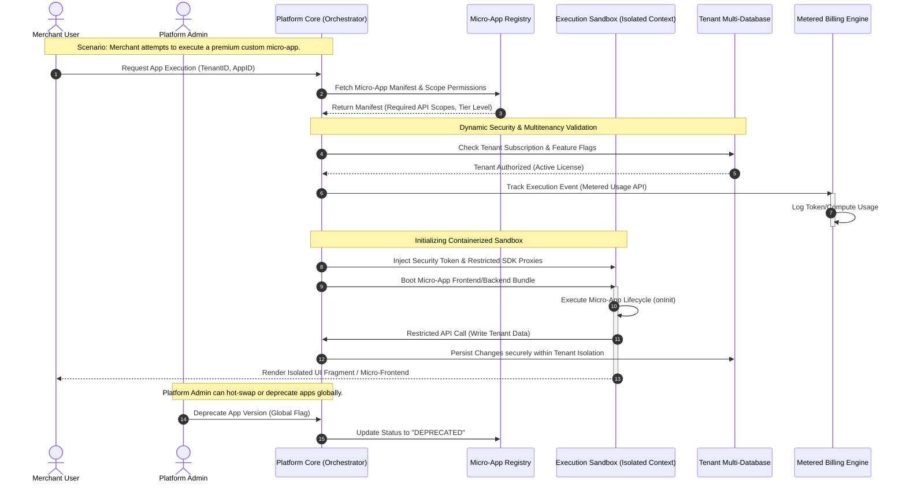

# Mermaid Diagram Driven Development (MDDD) CLI 🚀


---

# 🇺🇸 English

An agnostic, ultra-lightweight, and surgical CLI for implementing **MDDD (Mermaid Diagram Driven Development)** in a modular, co-located, and strictly versioned way.

This tool automates the creation and connection of visual specification files (Markdown + Mermaid + Decision Matrices). The goal is to encapsulate business rules within `.spec.md` files so that any AI tool (**Cursor, Windsurf, Claude Code, GitHub Copilot**, etc.) uses these assets as the **Single Source of Truth** before touching production code.

---

## 📌 The Concept: MDDD vs. Text-Based Specs

Unlike traditional specification frameworks that generate dozens of text files and "deltas" that pollute your repository, MDDD introduces a **Visual-First & Flow-Centric** paradigm:

1. **A Real Architectural Map:** Instead of flat text maps, MDDD allows you to connect micro-specifications into a macro system view. It behaves like a geographical map of your entire software architecture.
2. **Engineered for High Complexity & Massive CRUDs:** Complex states, multi-role validation, and heavy business rules are structured inside **Decision Matrices** in markdown tables. This eliminates visual layout saturation and handles complex behaviors with mathematical precision.
3. **Zero Asset Bloat (Git Native):** Requirements are versioned directly in place. AIs leveraging CLI capabilities or **MCP (Model Context Protocol)** can instantly query the Git history to understand evolutionary changes, meaning zero temporary files or architectural clutter.

---

## ⚖️ MDDD vs. OpenSpec (SDD)

| Feature / Paradigm | OpenSpec (Specification Driven Development) | MDDD (Mermaid Diagram Driven Development) |
| :--- | :--- | :--- |
| **Logic Structure** | Textual paragraphs, verbose rules, and conversational scenarios. | Binary/Factual Decision Matrices + Strict Structural Topologies. |
| **AI Context Consumption** | High token overhead due to massive text-based behavioral descriptions. | Ultra-low token footprint using concise matrix truth tables. |
| **Estimated Tokens per Rule (10 rules)** | **~8,000 – 12,000 tokens** (paragraphs + scenario descriptions + edge case text) | **~800 – 1,500 tokens** (10 matrix rows × 6 factor columns ≈ 60 cells of short text) |
| **Estimated Tokens per Rule (50 rules)** | **~40,000 – 60,000 tokens** (entire context window may be consumed) | **~4,000 – 7,500 tokens** (still fits comfortably within a small context) |
| **Scalability** | Adding rules creates massive text blocks prone to prompt fragmentation. | Adding rules scales horizontally by appending precise factor columns. |
| **Ambiguity Control** | High risk of LLM hallucination when interpreting nested "if/else" phrasing. | Mathematical precision; deterministic processing via matrix rows. |
| **Tool Footprint** | Massive boilerplate with a bloat of internal files and complex folder structures. | Ultra-lightweight modular architecture: a thin router + cleanly separated command and service modules, each easily audited by any human. |

### 🚀 Why MDDD Decision Matrices Outperform OpenSpec:
* **Predictable Tokens:** For an LLM, reading an MDDD matrix table is identical to processing a binary truth table. It matches primitive factor columns (`Active Tenant?`, `Global Kill Switch?`) and instantly resolves whether the outcome is `ALLOW` or `DENY` without token-wasting lexical processing.
* **10× to 15× Less Tokens:** A complex business rule with 6 variable factors costs ~800 tokens in MDDD vs ~8,000+ tokens in OpenSpec (paragraphs + edge case descriptions). As rules grow, MDDD stays linear while OpenSpec grows exponentially in verbosity.
* **Infinite Columns = Infinite Variables:** If your system gains a new architectural constraint (e.g., `Is Environment Production?` or `IP Whitelisted?`), you simply append a new column to the matrix. The business logic scales horizontally without bloating or breaking Mermaid visual flows.
* **A True Replacement for OpenSpec:** OpenSpec requires writing multiple paragraphs and descriptive test scenarios to cover complex constraint combinations. MDDD completely handles this in a single, deterministic table row—slashing prompt context overhead and completely eliminating AI hallucinations.

---

## 🛠️ The MDDD Pipeline

| Phase | Actor | Action / Trigger | What Happens |
| :--- | :--- | :--- | :--- |
| **1. Input** | Human | Feature Request | The user proposes a feature using natural language, points the AI directly to a Jira/GitHub Issue/Task, or asks AI to audit a legacy file. |
| **2. Conception** | AI | Autogeneration | The AI assesses the scope and builds the `.spec.md` file complete with flowcharts, lifecycles, and required **Decision Matrices**. |
| **3. Alignment** | Human | Interactive Review | The user reviews the specification within the editor. Refinements are handled iteratively by chatting with the AI. |
| **4. Planning** | AI | Task Breakdown | Once the spec is approved, the AI extracts a granular, atomic checklist of development steps directly within the file. |
| **5. Execution** | AI | Code Generation | The AI implements production code and tests strictly adhering to the specs, updating the semantic versioning on completion. |

---

## ✅ Mermaid Diagram Preview

### Architectural Diagram Example



### Micro-App Runtime & Lifecycle Decision Matrix Example

| Active Tenant? | Premium App? | Active Billing Tier? | User Has Role Admin? | App Whitelisted? | Global Kill Switch? | Proposed Action | Decision (Outcome) | Transition State (New Status) |
| --- | --- | --- | --- | --- | --- | --- | --- | --- |
| ❌ NO | - | - | - | - | - | `BOOT_APP` | ❌ **DENY** | - |
| ✅ YES | ❌ NO | **FREE** | ❌ NO | ✅ YES | ❌ NO | `BOOT_APP` | ✅ **ALLOW** | `ACTIVE_RUNTIME` |
| ✅ YES | ✅ YES | **FREE** | - | - | ❌ NO | `INSTALL_APP` | ❌ **DENY** | - (Trigger Upsell) |
| ✅ YES | ✅ YES | **ENTERPRISE** | ✅ YES | ✅ YES | ❌ NO | `INSTALL_APP` | ✅ **ALLOW** | `INSTALLED` |
| ✅ YES | - | - | ❌ NO | - | ❌ NO | `CONFIG_API` | ❌ **DENY** | - |
| ✅ YES | - | - | ✅ YES | - | ❌ NO | `CONFIG_API` | ✅ **ALLOW** | `CONFIGURED` |
| ✅ YES | - | - | - | - | ✅ YES | `BOOT_APP` | ❌ **DENY** | `MUTED_ISOLATION` |
| ✅ YES | - | - | - | - | ✅ YES | `HOT_RELOAD` | ❌ **DENY** | - |
| ❌ NO | - | - | - | - | - | `PURGE_DATA` | ❌ **DENY** | - |

---

## 📥 Installation

Since the package is published on NPM, installation is global and simple:

```bash
# Global installation
npm install -g mddd-cli

```

> **Note:** Make sure you have **Node.js v18 or higher** installed on your machine.

---

## 🚀 Quick Start Guide

The MDDD protocol is based on skills to orchestrate AI agents development.

### 1. Initialize your project

In your project root, run:

```bash
md init

```

This will create the `AGENTS.md` and `SKILL.md` files in the root directory, containing the global instructions that will guide the AI in understanding the MDDD methodology and interacting with Git logs.

### 2. Audit legacy files or make new ones.

 - Tell AI to `md-audit` the file you want to review. If it's clean and concise, AI will create the spec based on it. If it's not, then AI will propose a refactoring with the "to-be" spec.

 - Tell AI to `md-new` a specification you need, connect to a Jira/Task, to a Figma/Design or simple tell AI what to do.

### 3. Implement the specification.

Tell AI to `md-impl` pointing to a .spec file. It will read all the specification, create the task list and start working on it.

### 4. Edit existing specifications.

If you need to add a new feature or modify an existing one, just tell AI to `md-edit` the .spec file with the modifications you want.
Review it until you get exactly the specification you need and then tell AI to `md-impl` it.

---

## 🤖 SKILLS (AI Triggers)

After running `md init`, your AI will understand these shortcuts when you type them in the chat:

| Skill | Description |
| --- | --- |
| `md-new` | Starts design mode for a new feature from natural language or issue link (generates diagrams/matrices). |
| `md-edit` | Requests changes to an existing `.spec.md` file (increments semantic version). |
| `md-audit` | Analyzes legacy code and proposes visual refactoring (Mermaid). |
| `md-impl` | Generates code and tests strictly based on the `.spec.md` layout, managing version history. |
| `mddd-context-map` | Generates a multi-level product architecture diagram (flowchart LR) from all `.spec.md` files. Classifies specs as MACRO/MICRO, maps data flows, and produces an `ARCHITECTURE.spec.md` with styled nodes and labeled edges. |

---

## 🗺️ Architecture Context Map

The `mddd-context-map` skill teaches the AI agent to produce a **product architecture diagram** that visualizes your system at **multiple levels**:

- **Macro areas (domains)** — each MACRO spec represents a high-level domain or business capability.
- **Micro components/services** — MICRO specs are the building blocks inside each domain.
- **Data flows** — connections between users, UI, backend, serverless functions, and external infrastructure.

The output is a stylized **`flowchart LR`** that combines domain grouping with internal components and external integrations, using `classDef` styling to differentiate node types:

| Node Class | Purpose | Visual |
| :--- | :--- | :--- |
| `userNode` | People, personas, roles | Warm yellow |
| `systemNode` | Internal services/components | Professional blue |
| `externalNode` | Third-party APIs, partner systems | Stand-out red-orange |
| `infraNode` | Databases, queues, caches | Subdued italic gray |

### How to use

1. Initialize your project with `md init` (this copies the architecture template to `.agents/templates/`).
2. Ask the AI to generate the context map — it will scan all `.spec.md` files, classify them as MACRO/MICRO, and compose the diagram.
3. The output is saved to `ARCHITECTURE.spec.md` at the project root.
4. Every diagram is validated with `npx md validate` before being written.

---

## 🏗️ Co-located Specification Architecture

Visual specifications are not centralized in distant folders. They live in the **same directory** as the component, screen, or feature they describe, mapping out your software natively.

```
src/
└── home/
    ├── home.spec.md          # 🌎 Global module map
    ├── guest/
    │   ├── guest.spec.md     # 🔬 Screen flow with Decision Matrix
    │   └── guest_page.dart   # 💻 Production code generated by AI
    └── consumer/
        └── consumer.spec.md  # 🔬 Screen flow with Decision Matrix

```

---

## 📦 CLI Commands

| Command | Description |
| :--- | :--- |
| `md init` | Configures the `AGENTS.md` file and the SKILL.md files which instructs the AI how to behave. Run this everytime you update MDDD-CLI NPM Package. |
| `md status` | Generates a beautiful MDDD coverage report with metrics from all `.spec.md` files. Shows specs classification (Cohesive/Chaotic), discovery tasks progress, version changes, and impact metrics. |

### Project Architecture

The CLI codebase follows a clean modular architecture, as documented in `bin/cli.spec.md`:

```
bin/
├── cli.js                     # Thin Commander router (< 30 lines)
└── cli.spec.md                # Co-located spec (v3.0.0)

src/
├── commands/                  # Command layer
│   ├── init.js                # Init command
│   ├── listSpecs.js           # List specs command
│   ├── status.js              # Status command
│   ├── status.spec.md         # Status spec
│   └── validator.js           # Validator utility
├── services/                  # Shared services with DI
│   ├── FileSystemService.js
│   ├── FileSystemService.spec.md
│   ├── InitService.js
│   ├── InitService.spec.md
│   └── SpecFinderService.js

tests/
├── commands/
│   ├── init.spec.js
│   ├── listSpecs.spec.js
│   └── status.spec.js
```

---

## 🧪 Technologies

* **Node.js** >= 18
* **Commander.js** — Robust and declarative CLI interface
* **Picocolors** — Colorful and lightweight terminal output
* **Mermaid.js** — Visual diagramming as the source of truth
* **Built-in Test Runner** (`node:test`) — Zero-dependency unit testing

---

## 💬 Need help?

If you encounter any issues, open a [GitHub Issue](https://github.com/JulioCRFilho/mermaid-diagram-driven-development/issues).

---

## 📄 License

Distributed under the MIT license. See the [LICENSE](./LICENSE) file for more information.
