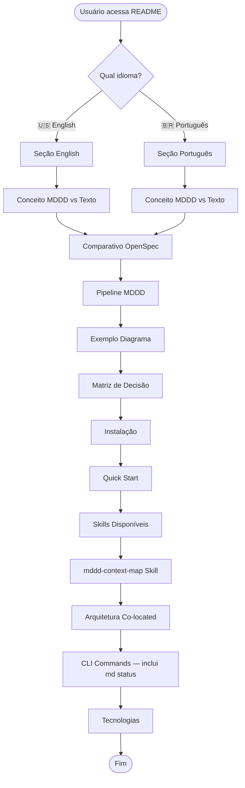

%% @spec-version 1.2.0
%% @protocol-version 1.0.0

# README.md — Specification

> **Status:** draft
> **Type:** Documentation / Marketing Material
> **Target:** readme.md (raiz do projeto)

---

## 1. Context

O `readme.md` é o documento principal de apresentação do projeto **MDDD CLI**. Ele serve como:

- **Ponto de entrada** para novos usuários e desenvolvedores
- **Documentação de marketing** que diferencia MDDD de abordagens tradicionais
- **Guia de uso rápido** com comandos e exemplos
- **Referência técnica** com diagramas e matrizes de decisão

**Related specs:** `bin/cli.spec.md` (especificação da CLI)

---

## 2. Behavioral Flow (Mermaid)

---

## 3. Decision Matrix

### 3.1 Primitive Factors

| Factor | Type | Allowed Values | Default |
| :--- | :--- | :--- | :--- |
| `Idioma Selecionado?` | Categorical | `EN`, `PT` | `EN` |
| `Usuário é Dev Senior?` | Binary | `✅ YES` / `❌ NO` | `—` |
| `Projeto já usa MDDD?` | Binary | `✅ YES` / `❌ NO` | `❌ NO` |
| `Necessita de Exemplos?` | Binary | `✅ YES` / `❌ NO` | `✅ YES` |
| `Inclui mddd-context-map?` | Binary | `✅ YES` / `❌ NO` | `✅ YES` |

### 3.2 Resolution Table

| Idioma Selecionado? | Usuário é Dev Senior? | Projeto já usa MDDD? | Necessita de Exemplos? | Inclui mddd-context-map? | Proposed Action | Decision | Transition State |
| :---: | :---: | :---: | :---: | :---: | :--- | :---: | :--- |
| `EN` | `✅ YES` | `✅ YES` | `❌ NO` | `✅ YES` | `SHOW_ADVANCED_DOCS` | ✅ ALLOW | `INFORMED` |
| `EN` | `✅ YES` | `❌ NO` | `✅ YES` | `✅ YES` | `SHOW_CONCEPTS_AND_EXAMPLES` | ✅ ALLOW | `INFORMED` |
| `EN` | `❌ NO` | `❌ NO` | `✅ YES` | `✅ YES` | `SHOW_FULL_GUIDE` | ✅ ALLOW | `INFORMED` |
| `PT` | `✅ YES` | `✅ YES` | `❌ NO` | `✅ YES` | `SHOW_ADVANCED_DOCS_PT` | ✅ ALLOW | `INFORMED` |
| `PT` | `✅ YES` | `❌ NO` | `✅ YES` | `✅ YES` | `SHOW_CONCEPTS_AND_EXAMPLES_PT` | ✅ ALLOW | `INFORMED` |
| `PT` | `❌ NO` | `❌ NO` | `✅ YES` | `✅ YES` | `SHOW_FULL_GUIDE_PT` | ✅ ALLOW | `INFORMED` |
| `-` | `-` | `-` | `-` | `-` | `SHOW_DEFAULT_EN` | ✅ ALLOW | `INFORMED` |

**Resolution rules:**

1. ALL columns must match the current system state.
2. If no row fully matches → `HaltWithConflict`.
3. If multiple rows match → `HaltWithConflict` (ambiguous).

---

## 4. Tasks

- [x] Validar diagrama Mermaid `sequenceDiagram` no README
- [x] Verificar tradução PT/EN está completa e consistente
- [x] Confirmar Decision Matrix reflete lógica real do README
- [x] Atualizar badges NPM e Node.js versions
- [x] Verificar links internos e externos
- [x] Padronizar formatação de tabelas
- [x] Revisar exemplos de código (bash commands)
- [x] Confirmar estrutura de arquitetura está atualizada
- [x] Incluir comando `md status` na seção CLI Commands (EN/PT)
- [x] Incluir skill `mddd-context-map` na seção SKILLS (EN/PT) com descrição
- [x] Adicionar seção dedicada à skill `mddd-context-map` com overview e referência ao template
- [x] Atualizar diagrama behavioral flow com nó `mddd-context-map Skill` e `CLI Commands — inclui md status`
- [x] Atualizar Decision Matrix com fator `Inclui mddd-context-map?`

---

## 5. Skill `mddd-context-map` — Seção Dedicada no README

O README deve conter uma seção dedicada explicando a skill `mddd-context-map`, que permite ao agente de IA gerar um **diagrama de arquitetura do produto** em múltiplos níveis. Esta seção deve incluir:

### 5.1 Conceito

A skill `mddd-context-map` ensina o agente a produzir um **diagrama de arquitetura de produto** que visualiza o sistema em **múltiplos níveis**:

- **Áreas Macro (domínios)** — cada spec MACRO representa um domínio de alto nível.
- **Micro componentes/serviços** — specs MICRO são os blocos construtivos dentro de cada domínio.
- **Fluxos de dados** entre usuários, UI, backend, funções serverless e infraestrutura externa.

O output é um **flowchart LR** estilizado que combina agrupamento por domínio com componentes internos e integrações externas.

### 5.2 Template de Saída

- Template path: `.agents/templates/ARCHITECTURE.template.md` (copiado por `md init`)
- Estrutura de 8 seções rígidas: Topology Overview → MACRO Decision Matrices → Cross-Domain Data Flow → External Integrations → Infrastructure Topology → Component Dependency Matrix → Generation Footer
- O diagrama usa `classDef` para diferenciar nós: `userNode` (amarelo), `systemNode` (azul), `externalNode` (vermelho), `infraNode` (cinza)

### 5.3 No README, a seção deve mostrar:

- Overview do que a skill faz (diagrama de arquitetura multi-nível)
- Referência ao comando que dispara a skill (após `md init`)
- Referência ao template gerado (`ARCHITECTURE.spec.md`)
- Regras rígidas: sempre usar `flowchart LR`, sempre aplicar `classDef`, sempre validar com `npx md validate`

---

## 6. Conflict Resolution Notes

| Conflict Source | Proposed Matrix Change | Status |
| :--- | :--- | :---: |
| `—` | `—` | `RESOLVED` |

---

## 7. Audit History

Click to expand

| Date | Agent | Version | Change Summary |
| :--- | :--- | :---: | :--- |
| 2026-06-10 | Cline (`md-impl`) | v1.1.0 | **Implementation complete.** Badges atualizados (v7.0.0, logos npm/node). Links LICENSE corrigidos (EN/PT). Estrutura de arquitetura atualizada com todos os arquivos. Tabelas padronizadas com `:---` alignment. |
| 2026-06-10 | Cline (`md-edit`) | v1.2.0 | **Added `md status` command and `mddd-context-map` skill.** Incluído comando `md status` na seção CLI Commands (EN/PT). Adicionada skill `mddd-context-map` na tabela SKILLS com descrição detalhada. Seção dedicada à skill `mddd-context-map` com overview do fluxo, modelo conceitual, template de saída e regras rígidas. Novo fator `Inclui mddd-context-map?` na Decision Matrix. Diagrama behavioral flow atualizado com nós `mddd-context-map Skill` e `CLI Commands — inclui md status`. |
| 2026-06-10 | Cline (`md-audit`) | v1.0.0 | **Spec created from audit.** Análise completa do readme.md existente. Diagrama Mermaid validado. Decision Matrix documentada. Status: **draft**. |

