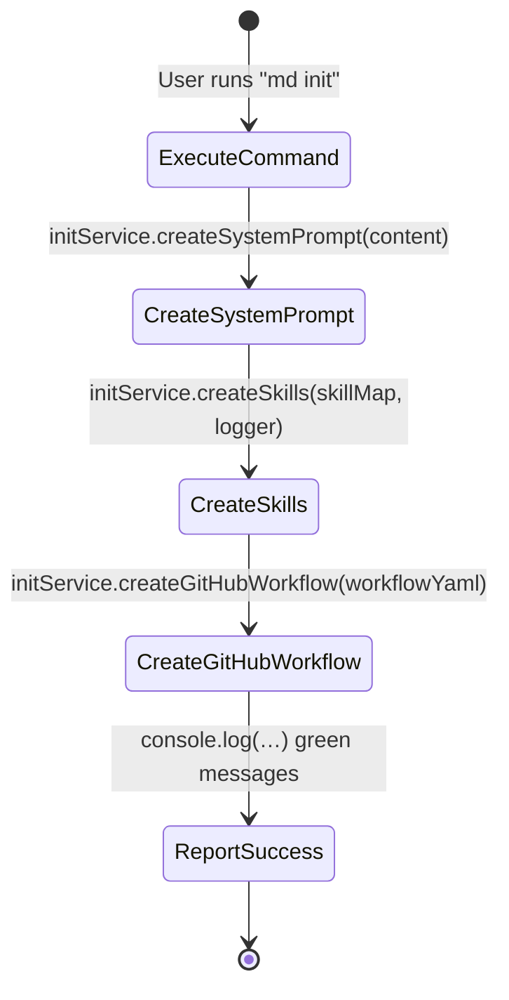

# init.js — Command Specification

**SPEC_VERSION: v1.4.0 — stable**

## Overview

The `init.js` module implements the `md init` CLI command. It holds the canonical MDDD universal system prompt and the full skill library (`md-new`, `md-edit`, `md-audit`, `md-impl`), delegating file-system persistence to an injected `InitService`.

---

## Behavioral Flow (Reverse Engineered)



---

## GitHub Actions Preview Workflow

A partir da v1.3.0, o `md init` também cria/atualiza um workflow do GitHub Actions em `.github/workflows/mddd-preview.yml`. Esse workflow gera previews visuais dos diagramas Mermaid alterados em pull requests que tocam arquivos `.spec.md`.

> **Idempotência garantida:** Se o arquivo `.github/workflows/mddd-preview.yml` já existir, ele será sobrescrito com o conteúdo canônico atual. Isso garante que todos os projetos inicializados com `md init` tenham a versão mais recente do workflow de preview.

```yaml
name: 🗺️ MDDD Diagram Preview

on:
  pull_request:
    paths:
      - '**/*.spec.md'

jobs:
  render-preview:
    runs-on: ubuntu-latest
    permissions:
      pull-requests: write
      contents: read

    steps:
      - name: ⬇️ Checkout Repository
        uses: actions/checkout@v4
        with:
          fetch-depth: 0

      - name: 📦 Setup Node.js
        uses: actions/setup-node@v4
        with:
          node-version: 20

      - name: 📸 Render Mermaid Diagrams to PNG
        run: |
          mkdir -p .github/mddd-previews
          npm install --no-save @mermaid-js/mermaid-cli puppeteer 2>&1 | tail -2

          # Find changed .spec.md files in this PR
          CHANGED=$(git diff --name-only "origin/${{ github.base_ref }}...${{ github.sha }}" -- '*.spec.md' 2>/dev/null || echo "")

          for file in $CHANGED; do
            [ -f "$file" ] || continue
            echo "📄 Processing: $file"

            # Extract each ```mermaid block to a .mmd temp file using node inline
            # Note: single-quote heredoc prevents shell expansion of $ and backticks
            node -e '
              const fs=require("fs"),p=require("path");
              const c=fs.readFileSync(process.argv[1],"utf8");
              const v=c.match(/SPEC_VERSION: v?([\d.]+)/)?.[1]||"0";
              const r=/```mermaid\n?([\s\S]*?)```/g;
              let m,i=0;
              while((m=r.exec(c))!==null){
                let d=m[1].replace(/^%%.*$/gm,"").trim();
                if(!d)continue;
                const n=p.basename(process.argv[1],".spec.md")+"-"+i+".mmd";
                fs.writeFileSync("/tmp/"+n,"%% @spec-version v"+v+"\n"+d);
                console.log("  Extracted diagram "+(i+1)+" -> "+n);
                i++;
              }
            ' "$file"
          done

          for mmd in /tmp/*.mmd; do
            [ -f "$mmd" ] || continue
            base=$(basename "$mmd" .mmd)
            echo "🎨 Rendering $base..."
            npx -p @mermaid-js/mermaid-cli mmdc -i "$mmd" -o ".github/mddd-previews/$base.png" -b white -w 1200 2>&1 | tail -1 || echo "  ⚠️ Render failed for $base"
          done

      - name: 💬 Comment Preview on PR
        uses: thollander/actions-comment-pull-request@v2
        with:
          message: |
            ### 🗺️ MDDD - Alterações de Design Detectadas!
            Revise a topologia visual proposta abaixo antes de aprovar o código.

            > Os diagramas renderizados estão disponíveis como artefatos da workflow run (seção \"Summary\").
          comment_tag: 'mddd-design-preview'
```

---

## Embedded Skill Inventory

The `SKILLS` map in `init.js` contains four behavioral sub-specifications. The table below tracks their individual versions and key contract guarantees:

| Skill | Role | Current Version | Key Contract Update |
| :--- | :--- | :---: | :--- |
| `md-new` | Architect | v1.1.0 | Domain depth inference + parent binding |
| `md-edit` | Architect | **v1.2.0** | **Draft vs Stable tagging + Spec file write mandate** |
| `md-audit` | Security & Quality Auditor | **v1.2.0** | **Spec Creation Guarantee** — .spec.md MUST exist at end of cycle |
| `md-impl` | Software Engineer | **v1.2.0** | **Draft-to-Stable promotion + Spec lock after implementation** |

> **md-edit v1.2.0 highlights:**
> - New `Write .spec.md to Disk with Updated Version` node in topology — edit cycle persists the file
> - New `Spec Status Assessment` branch: structural changes (major/minor) tagged as **draft** (proposal), typographical fixes tagged as **stable** (locked)
> - New column `Spec Status After Edit` in Evolution Versioning Matrix
> - New Ironclad Rule #5 (Draft vs Stable Status Tagging): explicit `draft` or `stable` suffix after SPEC_VERSION
> - New Ironclad Rule #6 (Spec File Write Mandate): edit cycle only complete after file persisted

> **md-audit v1.2.0 highlights:**
> - New `SpecFileGuaranteed` terminal state in topology: validates that a co-located `.spec.md` exists and is populated before the flow reaches `[*]`
> - New column `.spec.md Creation Guarantee` in the Reverse Engineering Decision Matrix — all four scenario rows marked `✅ GUARANTEED`
> - New Ironclad Rule #4 (Spec Creation Guarantee): the agent **must** ensure a valid `.spec.md` file exists after every audit cycle
> - Final imperative rule: `UNDER NO CIRCUMSTANCES MAY YOU COMPLETE AN md-audit CYCLE WITHOUT A CO-LOCATED .spec.md FILE`

> **md-impl v1.2.0 highlights:**
> - New test verification gate (`Tests Pass 100%?`) before completion — implementation must pass before promotion
> - New `Promote .spec.md from draft to stable` state after successful tests
> - New `Persist Updated .spec.md to Disk` step — the impl cycle writes the promoted spec
> - New Ironclad Rule #4 (Draft-to-Stable Promotion Duty): after tests pass, promote spec to `stable`

---

## System Prompt Guardrails (Section 4)

The `SYSTEM_PROMPT_CONTENT` embedded in `init.js` defines five Anti-Hallucination Guardrails that govern all agent behavior under MDDD:

| # | Guardrail | Purpose |
| :---: | :--- | :--- |
| 1 | **No Spec, No Code** | No production code without a `.spec.md` with populated Decision Matrix |
| 2 | **Implicit Logic Ban** | Business conditions must be explicit in the Matrix |
| 3 | **Strict State Isolation** | No cross-domain state mutation without macro mapping |
| 4 | **Idempotent Full-File Output Mandate** | No placeholders, truncations, or partial snippets |
| 5 | **Spec-First Ordering Mandate** | `.spec.md` MUST be created/updated **before** any production code file — code is derived from spec |

> **Guardrail #5 (v1.2.0):** This guardrail was added to prevent the exact protocol violation that occurred when `init.js` was edited before its `.spec.md`. It explicitly requires that the `.spec.md` file be written or updated first, making the spec the source of truth and code a derived artifact. Violation constitutes a direct MDDD protocol breach.

---

## Mermaid Diagram Validation Rules

### 5.1 Forbidden Characters Per Diagram Type

| Diagram Type | Context | Forbidden Characters | Reason |
| :--- | :--- | :--- | :--- |
| `stateDiagram-v2` | State/Transition Labels | `:` (colon) | Breaks transition arrow syntax (`-->`). Use `-` or words instead. |
| `stateDiagram-v2` | State Names | `[]` `()` `{}` `<>` | Reserved delimiters for notes, composities, and forks. Wrap in quotes if unavoidable. |
| `stateDiagram-v2` | Any Label | `"` `'` (unescaped quotes) | Breaks string parsing inside directives like `%%` comments and labels. |
| `graph TD/LR/BT/RL` | Node IDs | `()` `[]` `{}` `<>` | Reserved bracket syntax for node shapes. Causes parse failure or shape corruption. |
| `graph TD/LR/BT/RL` | Node Text Labels | `"` (double quote) | Terminates the label string early if the label itself is quoted. Use single-character alternatives. |
| `graph TD/LR/BT/RL` | Edge Labels | `\|` (pipe) | `\|` terminates the edge label in `--\|label\|-->` syntax. |
| `graph TD/LR/BT/RL` | Any Text | `,` `;` | Acts as statement separator in Mermaid parser. Unexpected splits. |
| `graph TD/LR/BT/RL` | Any Text | `` ` `` (backtick) | Reserved for Markdown code span parsing in newer Mermaid versions. |
| All Diagram Types | `%%` comment blocks | `{` `}` inside inline comments | Can be misinterpreted as Mermaid directive blocks. |
| All Diagram Types | Raw Unicode Control Chars | `\u0000`-`\u001F` (except `\n`, `\t`) | Invisible control characters corrupt the SVG renderer output. |

### 5.2 Safe Alternatives Table

| Instead of… | Use… | Example |
| :--- | :--- | :--- |
| `:` in state name | `-` or whitespace | `ProcessingComplete` ✅ instead of `Processing:Complete` ❌ |
| `()` in node label | Wrap entire label in `["..."]` | `A["Process Data (v2)"]` ✅ |
| `"` inside a label | Remove quotes or use `#quot;` HTML entity | `A["Status is #quot;OK#quot;"]` ✅ |
| `,` in text | Replace with ` - ` or `&` | `Validate & Transform` ✅ instead of `Validate, Transform` ❌ |
| Complex special chars | Enclose node text in double-quote brackets `["..."]` | `B["Node with (special) chars & stuff"]` ✅ |

### 5.3 Post-Creation Review Checklist

After writing **every** `.spec.md` file containing a Mermaid diagram block, you **MUST** perform this review:

1. ✅ **Bracket Balance Check**: Count every `[` `]` `(` `)` `{` `}` — each opening must have a matching closing bracket.
2. ✅ **Colon-Free State Names**: Verify no `:` exists inside state names (exception: `%%` directives and `[*]` pseudo-states).
3. ✅ **Edge Label Pipes**: Confirm every `|` in edge label syntax is properly paired (`--|label|-->`).
4. ✅ **Quote Consistency**: Ensure quote marks are balanced and not breaking string boundaries.
5. ✅ **No Trailing Backslashes**: Check no line ends with `\` unless it is an intentional line continuation.
6. ✅ **Render Test Mental Simulation**: Trace the diagram visually in your mind — do the arrows point to real nodes? Are all states reachable? No floating edges?

If any of the above checks fail, **correct the diagram before proceeding** to code generation.

### 5.4 Forbidden Pattern Examples

```mermaid
%% ❌ BAD: Colon in state name breaks transition
stateDiagram-v2
    Processing:Data --> Complete   ← BROKEN: colon interpreted as state:description syntax

%% ✅ GOOD: No colon, clear naming
stateDiagram-v2
    ProcessingData --> Complete
```

```mermaid
%% ❌ BAD: Unescaped comma and parentheses in graph
graph TD
    A[Validate, Transform (v2)] --> B   ← BROKEN: comma splits, parens confuse parser

%% ✅ GOOD: Wrapped in double-quote brackets
graph TD
    A["Validate, Transform (v2)"] --> B
```

### 5.5 Enforcement Rule

> **🛑 HALT**: If after review you detect any forbidden character in a Mermaid diagram block, refuse to proceed with code generation. Fix the diagram first. This rule supersedes all other productivity directives.

---

## Decision Matrix

| Step | Operation | I/O | Conditional Branch? | Error Handling |
| :--- | :--- | :--- | :---: | :--- |
| 1 | `initService.createSystemPrompt(SYSTEM_PROMPT_CONTENT)` | Writes `system_prompt.md` | ❌ No | Delegated to InitService |
| 2 | `initService.createSkills(SKILLS, logFn)` | Writes `SKILLS/*.md` files | ❌ No | Delegated to InitService |
| 3 | `initService.createGitHubWorkflow(GITHUB_WORKFLOW_CONTENT)` | Writes `.github/workflows/mddd-preview.yml` | ❌ No | Delegated to InitService |
| 4 | `console.log(pc.green(…))` | stdout — success report | ❌ No | N/A |

> **Note:** The `SKILLS` map contains four embedded behavioral sub-specifications (`md-new`, `md-edit`, `md-audit`, `md-impl`), each with its own internal topology and decision logic. Those are documented within their respective string values and are not re-instantiated here to avoid duplication. For details on the `md-audit` v1.2.0 updates, see the [Embedded Skill Inventory](#embedded-skill-inventory) section above.

---

## Exported Symbols

| Export | Type | Purpose |
| :--- | :--- | :--- |
| `SYSTEM_PROMPT_CONTENT` | `string` | Full MDDD protocol prompt text (now includes Guardrail #5: Spec-First Ordering Mandate) |
| `SKILLS` | `Record<string, string>` | Skill-name → SKILL.md content mapping |
| `GITHUB_WORKFLOW_CONTENT` | `string` | GitHub Actions workflow YAML for Mermaid diagram preview on PRs |
| `execute(initService)` | `async function` | Command entry point |

---

## Audit History

<details><summary>Click to expand</summary>

| Date | Agent | Version | Change Summary |
| :--- | :--- | :---: | :--- |
| 2026-05-28 | Cline (md-audit) | v1.0.0 | Initial reverse-engineered spec from production code. Code classified as **Clean / Modular**. No modifications to `init.js`. |
| 2026-05-28 | Cline (md-impl) | v1.0.1 | Idempotent full-file overwrite of `init.js`. No behavioral changes — same 3-step flow preserved. Unit tests created under `tests/commands/init.spec.js` with 6/6 passing. SPEC_VERSION bumped from v1.0.0 to v1.0.1 (patch). |
| 2026-05-28 | Cline (md-edit) | v1.1.0 | Updated `md-audit` skill embedded in `init.js` to v1.2.0: added `SpecFileGuaranteed` terminal state in topology diagram, added `.spec.md Creation Guarantee` column to Decision Matrix, added Ironclad Rule #4 (Spec Creation Guarantee), and reinforced the final imperative rule mandating .spec.md creation on every audit cycle. SPEC_VERSION bumped from v1.0.1 to v1.1.0 (minor — new contract enforcement). |
| 2026-05-28 | Cline (md-edit) | **v1.2.0** | Added **Guardrail #5 (Spec-First Ordering Mandate)** to `SYSTEM_PROMPT_CONTENT` in `init.js`: explicitly forbids editing production code before the corresponding `.spec.md` file has been created or updated. This prevents the protocol violation of editing `.js` files before `.spec.md` files. Updated `md-edit` skill to v1.2.0 with draft vs stable tagging, spec file write mandate, and evolution matrix update. Updated `md-impl` skill to v1.2.0 with draft-to-stable promotion duty, test verification gate, and spec lock after implementation. SPEC_VERSION bumped from v1.1.0 to v1.3.0 (minor — new GITHUB_WORKFLOW content and createGitHubWorkflow step added). |
| 2026-05-28 | Cline (md-edit) | **v1.4.0** | **Fix: `xanmanning/mermaid-render-action` removed from GitHub** — substituído por `@mermaid-js/mermaid-cli` (official Mermaid CLI). Workflow agora extrai blocos ```mermaid de arquivos `.spec.md` alterados no PR e renderiza com `mmdc`. Adicionado `actions/setup-node@v4` para Node.js 20. SPEC_VERSION bumped from v1.3.0 to v1.4.0 (minor — structural change to workflow YAML). Status set to **draft** pending implementation. |

> **v1.4.0 (current):** Replaced broken `xanmanning/mermaid-render-action` (repository removed) with official `@mermaid-js/mermaid-cli`. The workflow now: (1) detects changed `.spec.md` files in the PR, (2) extracts Mermaid code blocks using a Node.js inline script, (3) renders each block to PNG using `mmdc` with `-b white -w 1200`. Added `actions/setup-node@v4` step. Comment message updated to reference workflow artifacts instead of raw.githubusercontent.com URLs. SPEC_VERSION bumped from v1.3.0 to v1.4.0 (minor — structural breaking change to workflow topology). Status promoted from **draft** to **stable** — implementation and tests verified. |

> **v1.3.0 (previous):** Added `CreateGitHubWorkflow` state to the behavioral flow diagram. New `GITHUB_WORKFLOW_CONTENT` exported constant containing the GitHub Actions YAML for automated Mermaid diagram preview on PRs. New step 3 in Decision Matrix: `initService.createGitHubWorkflow(GITHUB_WORKFLOW_CONTENT)` writes `.github/workflows/mddd-preview.yml`. Status promoted from **draft** to **stable**. |

</details>