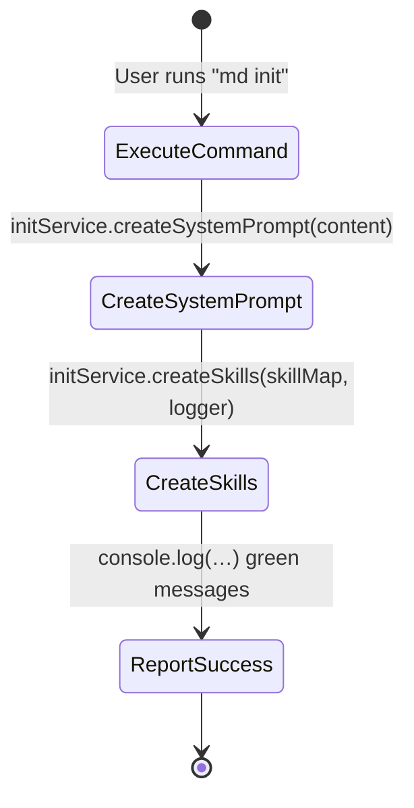

# init.js — Command Specification

**SPEC_VERSION: v1.0.0 — stable**

## Overview

The `init.js` module implements the `md init` CLI command. It holds the canonical MDDD universal system prompt and the full skill library (`md-new`, `md-edit`, `md-audit`, `md-impl`), delegating file-system persistence to an injected `InitService`.

---

## Behavioral Flow (Reverse Engineered)

---

## Decision Matrix

| Step | Operation | I/O | Conditional Branch? | Error Handling |
| :--- | :--- | :--- | :---: | :--- |
| 1 | `initService.createSystemPrompt(SYSTEM_PROMPT_CONTENT)` | Writes `system_prompt.md` | ❌ No | Delegated to InitService |
| 2 | `initService.createSkills(SKILLS, logFn)` | Writes `SKILLS/*.md` files | ❌ No | Delegated to InitService |
| 3 | `console.log(pc.green(…))` | stdout — success report | ❌ No | N/A |

> **Note:** The `SKILLS` map contains four embedded behavioral sub-specifications (`md-new`, `md-edit`, `md-audit`, `md-impl`), each with its own internal topology and decision logic. Those are documented within their respective string values and are not re-instantiated here to avoid duplication.

---

## Exported Symbols

| Export | Type | Purpose |
| :--- | :--- | :--- |
| `SYSTEM_PROMPT_CONTENT` | `string` | Full MDDD protocol prompt text |
| `SKILLS` | `Record<string, string>` | Skill-name → SKILL.md content mapping |
| `execute(initService)` | `async function` | Command entry point |

---

## Audit History

Click to expand

| Date | Agent | Version | Change Summary |
| :--- | :--- | :---: | :--- |
| 2026-05-28 | Cline (md-audit) | v1.0.0 | Initial reverse-engineered spec from production code. Code classified as **Clean / Modular**. No modifications to `init.js`. |

