# status — Specification

**SPEC_VERSION:** v1.0.0 — stable
**Classification:** Coeso

## Overview

The `md status` command scans all `.spec.md` files in the project, extracts metrics from each spec's **Tasks** checklist and **Audit History** table, and generates a beautiful color-coded dashboard showing the MDDD protocol coverage: discoveries, fixes, improvements, documentation, refactors, task completion rates, and version evolution.

Reuses `SpecFinderService.findSpecs()` to discover specs — no custom file walking.

---

## Behavioral Flow (Mermaid)

```mermaid
%% @spec-version v1.0.0
stateDiagram-v2
    [*] --> FindSpecs: specFinder.findSpecs(process.cwd())

    state FindSpecs {
        [*] --> WalkTree: readdirSync + recursion
        WalkTree --> CollectSpecs: filter *.spec.md
        CollectSpecs --> [*]: return sorted string[]
    }

    FindSpecs --> NoSpecs: specs.length === 0
    NoSpecs --> PrintEmpty: pc.yellow warning
    PrintEmpty --> [*]

    FindSpecs --> AnalyzeLoop: for each spec

    state AnalyzeSpec {
        [*] --> ReadFile: read spec file
        ReadFile --> ParseVersion: extract version
        ParseVersion --> ParseStatus: detect draft or stable
        ParseStatus --> ParseClassification: detect Coeso or Caótico
        ParseClassification --> ParseTasks: count checklist items
        ParseTasks --> ParseAudit: extract audit rows
        ParseAudit --> ClassifyChanges: keyword analysis
        ClassifyChanges --> [*]: return SpecMetrics
    }

    AnalyzeLoop --> AnalyzeSpec
    AnalyzeSpec --> NextSpec: more specs remaining
    NextSpec --> AnalyzeSpec
    AnalyzeSpec --> Aggregate: all specs processed

    state Aggregate {
        [*] --> SumTasks: sum totals across specs
        SumTasks --> SumChanges: sum MAJOR/MINOR/PATCH
        SumChanges --> BuildCriticalPoints: detect anomalies
        BuildCriticalPoints --> [*]: return DashboardSummary
    }

    Aggregate --> PrintDashboard

    state PrintDashboard {
        [*] --> PrintHeader: render title box
        PrintHeader --> PrintSpecs: coeso-caotico-unclassified
        PrintSpecs --> PrintTasks: tasks with progress bar
        PrintTasks --> PrintChanges: MAJOR-MINOR-PATCH
        PrintChanges --> PrintImpact: discoveries-fixes-etc
        PrintImpact --> PrintCritical: warnings highlighted
        PrintCritical --> PrintFooter: timestamps and version
        PrintFooter --> [*]
    }

    PrintDashboard --> [*]: exit 0
```

---

## Decision Matrix

### Primitive Factors

| Factor | Type | Allowed Values | Default |
| :--- | :--- | :--- | :--- |
| Specs found in project? | Binary | `✅ YES` / `❌ NO` | `❌ NO` |
| Has Tasks section? | Binary | `✅ YES` / `❌ NO` | `❌ NO` |
| Has Audit History table? | Binary | `✅ YES` / `❌ NO` | `❌ NO` |
| Has Coeso/Caótico classification? | Binary | `✅ YES` / `❌ NO` | `❌ NO` |
| Total specs > 0? | Binary | `✅ YES` / `❌ NO` | `❌ NO` |

### Resolution Table

| Specs found? | Has Tasks? | Has Audit? | Has Classif.? | Total > 0? | Proposed Action | Decision | Transition State |
| :---: | :---: | :---: | :---: | :---: | :--- | :---: | :--- |
| ❌ NO | - | - | - | ❌ NO | `PRINT_DASHBOARD` | ✅ ALLOW | `EMPTY` |
| ✅ YES | ❌ NO | ❌ NO | ❌ NO | ✅ YES | `PRINT_DASHBOARD` | ✅ ALLOW | `BASIC` |
| ✅ YES | ✅ YES | ❌ NO | ❌ NO | ✅ YES | `PRINT_DASHBOARD` | ✅ ALLOW | `TASKS_ONLY` |
| ✅ YES | ❌ NO | ✅ YES | ❌ NO | ✅ YES | `PRINT_DASHBOARD` | ✅ ALLOW | `AUDIT_ONLY` |
| ✅ YES | ✅ YES | ✅ YES | ❌ NO | ✅ YES | `PRINT_DASHBOARD` | ✅ ALLOW | `FULL` |
| ✅ YES | ✅ YES | ✅ YES | ✅ YES | ✅ YES | `PRINT_DASHBOARD` | ✅ ALLOW | `FULL_CLASSIFIED` |

> `-` = wildcard / any value matches.

### Resolution Rules (per MDDD protocol, section 3.3)

1. ALL columns must match the current system state.
2. If no row fully matches → `HaltWithConflict`.
3. If multiple rows match → `HaltWithConflict` (ambiguous).

---

## Tasks

Atomic checklist derived from the spec above:

- [x] Create `src/commands/status.js` with full analysis and dashboard logic
- [x] Create `src/commands/status.spec.md` (this file)
- [x] Edit `bin/cli.js` — register the `status` command
- [x] Edit `bin/cli.spec.md` — update topology, matrix, and audit history
- [x] Create `tests/commands/status.spec.js` with 5 test scenarios
- [x] Run tests: `node --test tests/commands/status.spec.js`
- [x] Run live: `node bin/cli.js status` and verify dashboard output

---

## Audit History

Click to expand

| Date | Agent | Version | Change Summary |
| :--- | :--- | :---: | :--- |
| 2026-06-09 | Cline (md-edit) | v1.0.1 | **Fixed SPEC_VERSION header format** (added colon separator per template spec) and **added Classification: Coeso** field — resolves validation error where spec lacked required Coeso/Caótico classification that its own diagram and decision matrix reference. PATCH bump. |
| 2026-06-08 | Cline (md-edit) | v1.0.0 | **Spec created from template.** Behavioral flow covers the full pipeline: FindSpecs → AnalyzeLoop → Aggregate → PrintDashboard. Decision Matrix covers 5 primitive factors with 6 resolution rows. Tasks checklist mirrors implementation order. All 7 tasks completed and verified — 5/5 tests passing on `node --test tests/commands/status.spec.js`. Validated against 71-spec project (Appfy). Status promoted to **stable**. |

