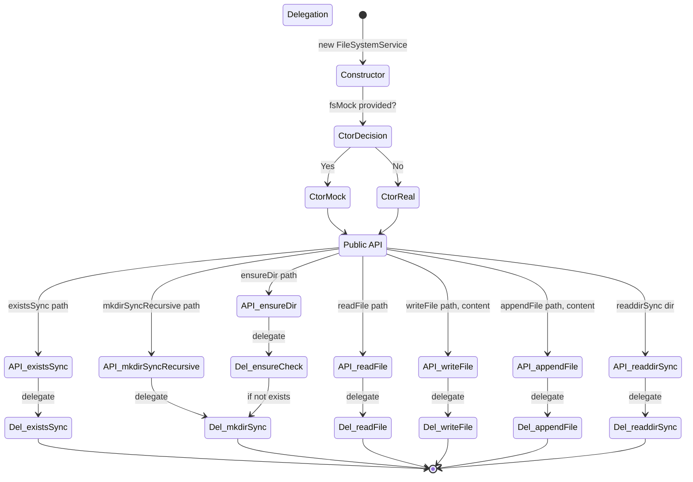

# FileSystemService — Specification

**SPEC_VERSION: v1.0.0 — stable**

## Overview

The `FileSystemService` class provides a thin abstraction layer over Node.js `fs/promises` and `sync` fs operations. It supports **dependency injection** via constructor mock parameter, enabling unit testing of consumers without touching real disk I/O.

Co-located with `src/services/FileSystemService.js`.

---

## Behavioral Flow (Mermaid)

---

## Decision Matrix

### Primitive Factors

| Method | Async | Sync | Returns | FS Read | FS Write (Side Effect) | Conditional Branch | Error Propagation |
| :--- | :---: | :---: | :--- | :---: | :---: | :---: | :--- |
| `readFile(path)` | ✅ | ❌ | `Promise<string>` | ✅ | ❌ | ❌ | Delegated to fs |
| `writeFile(path, content)` | ✅ | ❌ | `Promise<void>` | ❌ | ✅ Overwrite | ❌ | Delegated to fs |
| `appendFile(path, content)` | ✅ | ❌ | `Promise<void>` | ❌ | ✅ Append | ❌ | Delegated to fs |
| `existsSync(path)` | ❌ | ✅ | `boolean` | ✅ | ❌ | ❌ | N/A |
| `mkdirSyncRecursive(path)` | ❌ | ✅ | `void` | ❌ | ✅ Dir create | ❌ | Delegated to fs |
| `ensureDir(path)` | ❌ | ✅ | `void` | ❌ | ✅ Dir create | ✅ if !exists → mkdir | Delegated to fs |
| `readdirSync(dir)` | ❌ | ✅ | `string[]` | ✅ | ❌ | ❌ | Delegated to fs |

### DI Testability Factors

| Factor | Value | Impact |
| :--- | :---: | :--- |
| Constructor accepts mock? | ✅ YES | `Partial<FileSystemOperations>` optional parameter |
| Fallback to real fs? | ✅ YES | Each property uses `||` fallback when mock field is undefined |
| All 7 operations injectable? | ✅ YES | `readFile`, `writeFile`, `appendFile`, `existsSync`, `mkdirSyncRecursive`, `readdirSync` |
| No global state? | ✅ YES | Instance-scoped `#fs` private field |
| Consumers can be tested without disk? | ✅ YES | `InitService` and any consumer receive mock via constructor |

---

## Consumed By

| Consumer | File | Dependency Mechanism |
| :--- | :--- | :--- |
| `InitService` | `src/services/InitService.js` | Constructor injection (`#fs` field) |
| `init.js` (command) | `src/commands/init.js` | Indirect via `InitService` |

---

## Audit History

Click to expand

| Date | Agent | Version | Change Summary |
| :--- | :--- | :---: | :--- |
| 2026-05-28 | Cline (md-audit) | v1.0.0 | **Spec created by md-audit.** Reverse-engineered from `src/services/FileSystemService.js` (38 lines). Code classified as **Clean / DI-ready**. All 7 methods documented with primitive factor analysis. No modifications to production code. |

