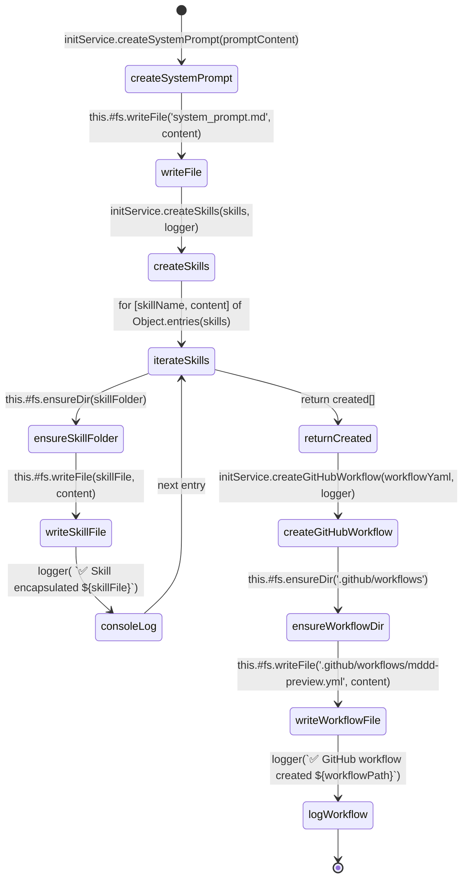

# InitService — Specification

**SPEC_VERSION: v1.1.0 — stable**

## Overview

The `InitService` class orchestrates the `md init` command business logic: creating the universal system prompt file and the full skill library directory structure. It receives a `FileSystemService` instance via constructor injection — no direct `fs` calls.

Co-located with `src/services/InitService.js`.

---

## Behavioral Flow (Mermaid)

---

## Decision Matrix

| Step | Method | I/O | Conditional Branch? | Error Handling | FS Side Effect |
| :--- | :--- | :--- | :---: | :--- | :--- |
| 1 | `createSystemPrompt(promptContent)` | Input: `string` Output: `Promise<void>` | ❌ No | Delegated to `#fs.writeFile` | ✅ Writes `system_prompt.md` |
| 2 | `createSkills(skills, logger)` | Input: `Record<string,string>` + logger fn Output: `Promise<string[]>` | ❌ No (iteration only) | Delegated to `#fs` methods | ✅ Creates `.agents/`, `.agents/skills/`, `skillName/SKILL.md` per entry |
| 3 | `createGitHubWorkflow(workflowYaml, logger)` | Input: `string` + logger fn Output: `Promise<string>` | ❌ No | Delegated to `#fs` methods | ✅ Creates `.github/workflows/mddd-preview.yml` |
| 4 | `this.#fs.ensureDir(agentsDir)` | Path: `'.agents'` | ✅ Internal in FS: conditional mkdir | Delegated | ✅ Dir creation |
| 5 | `this.#fs.ensureDir(skillsDir)` | Path: `'.agents/skills'` | ✅ Internal in FS: conditional mkdir | Delegated | ✅ Dir creation |
| 6 | `this.#fs.ensureDir(skillFolder)` | Path: per skill | ✅ Internal in FS: conditional mkdir | Delegated | ✅ Dir creation |
| 7 | `this.#fs.ensureDir(workflowsDir)` | Path: `'.github/workflows'` | ✅ Internal in FS: conditional mkdir | Delegated | ✅ Dir creation |
| 8 | `logger(…)` | stdout message | ❌ No | N/A | ❌ None |

---

## Exported Symbols

| Export | Type | Purpose |
| :--- | :--- | :--- |
| `InitService` | `class` | Orchestrates system prompt and skill creation via injected `FileSystemService` |

---

## Depends On

| Dependency | File | Mechanism |
| :--- | :--- | :--- |
| `FileSystemService` | `src/services/FileSystemService.js` | Constructor injection (`#fs` private field) |

---

## Audit History

Click to expand

| Date | Agent | Version | Change Summary |
| :--- | :--- | :---: | :--- |
| 2026-05-28 | Cline (md-audit) | v1.0.0 | **Spec created by md-audit.** Reverse-engineered from `src/services/InitService.js` (52 lines). Code classified as **Clean / Service with DI**. All orchestration steps documented with primitive factor analysis. No modifications to production code. |
| 2026-05-28 | Cline (md-edit) | v1.1.0 | **New method `createGitHubWorkflow`.** Added to support `md init` creating `.github/workflows/mddd-preview.yml`. Updated behavioral flow diagram with new states. Updated Decision Matrix with steps 3, 7, 8. SPEC_VERSION bumped from v1.0.0 to v1.1.0 (minor — new method). Status promoted from **draft** to **stable** — implementation and tests verified. |

