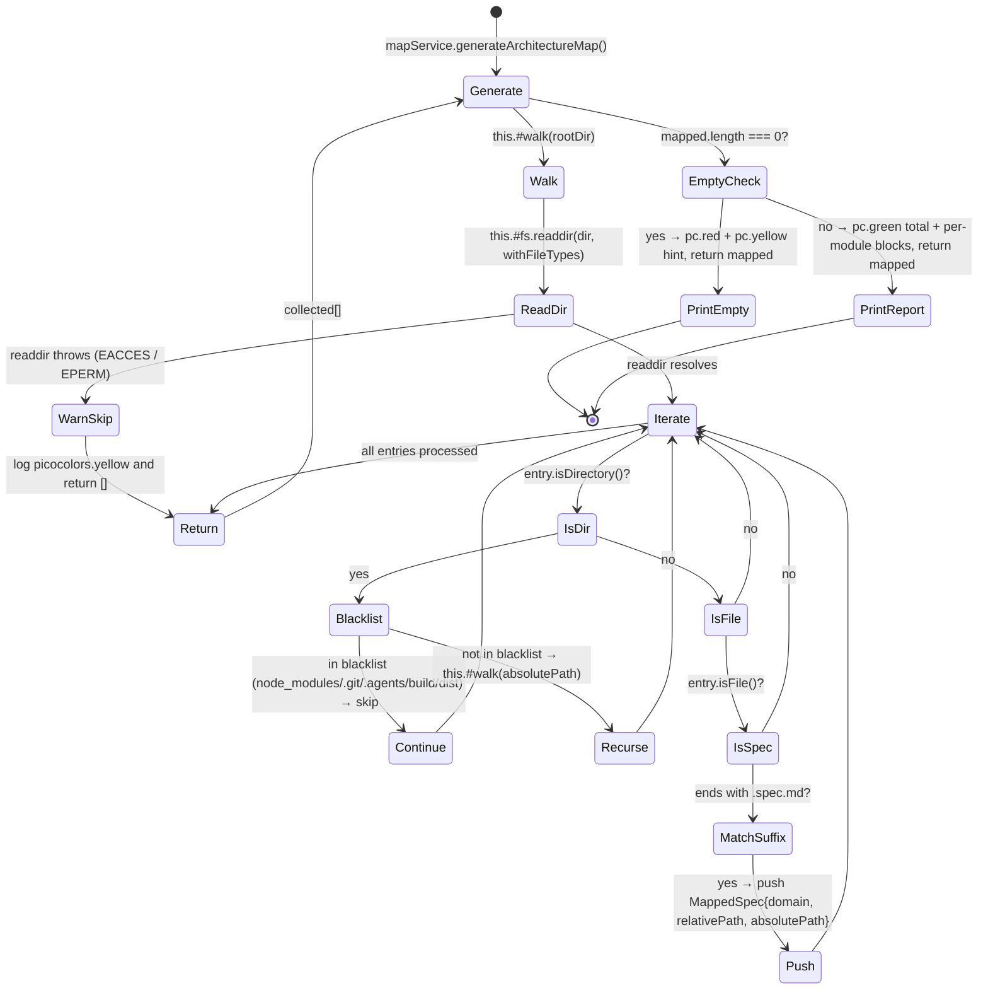

# MapService — Specification

**SPEC_VERSION: v1.0.0 — stable**

## Overview

The `MapService` class is responsible for the `md map` command business logic: scanning the user's project tree recursively to track every co-located `.spec.md` file and printing a clean architecture map of the discovered domains. It receives an optional `FileSystemReader` mock via constructor injection — no direct `fs` calls are mandatory.

Co-located with `src/services/MapService.js`.

---

## Behavioral Flow (Mermaid)

---

## Decision Matrix

| Step | Method | I/O | Conditional Branch? | Error Handling | FS Side Effect |
| :--- | :--- | :--- | :---: | :--- | :--- |
| 1 | `generateArchitectureMap()` | Input: none Output: `Promise<MappedSpec[]>` | ✅ Checks `mapped.length === 0` | Try/catch around `readdir` (fail-safe) | ❌ Read-only |
| 2 | `#walk(dir)` (private) | Input: `string` (cursor, defaults to root) Output: `Promise<MappedSpec[]>` | ✅ Recursive descent with blacklist pruning | `try/catch` around `readdir` → warn + return `[]` | ❌ Read-only |
| 3 | `this.#fs.readdir(dir, { withFileTypes: true })` | Path: `string` (absolute dir) | ❌ No | `try/catch` → `console.warn(pc.yellow(…))` and `return []` | ✅ Read |
| 4 | Blacklist pruning (`node_modules`, `.git`, `.agents`, `build`, `dist`) | Set membership check | ✅ `Set.has(entry.name)` | N/A — early `continue` | ❌ Read-only |
| 5 | `entry.isFile()` filter | Dirent inspection | ✅ Reject non-files | N/A | ❌ Read-only |
| 6 | Suffix check `entry.name.endsWith('.spec.md')` | String comparison | ✅ Reject non-matches | N/A | ❌ Read-only |
| 7 | `path.basename(absolutePath, '.spec.md').toUpperCase()` | Domain extraction | ❌ No | N/A | ❌ None |
| 8 | `path.relative(process.cwd(), absolutePath)` | Path normalization | ❌ No | N/A | ❌ None |
| 9 | Empty-state output | `pc.red(...)` + `pc.yellow(...)` | ✅ `mapped.length === 0` | N/A | ❌ None |
| 10 | Success output | `pc.green(total)` + per-module block | ❌ No | N/A | ❌ None |

---

## Cross-Platform Path Strategy

All emitted paths are converted to **paths relative to `process.cwd()`** via `path.relative(process.cwd(), absolutePath)`. This guarantees identical output on Windows, macOS, and Linux (no `C:\` prefixes, no mixed separators) so the architecture map remains stable across developer machines and CI runners.

---

## Blacklist Rationale

| Directory | Reason for Exclusion |
| :--- | :--- |
| `node_modules` | Dependency tree — too deep, can cause stack overflow |
| `.git` | VCS internal data — irrelevant to architecture mapping |
| `.agents` | CLI-internal skills/templates — not part of the user project domain |
| `build` | Build output — generated artifacts |
| `dist` | Distribution output — generated artifacts |

---

## Exported Symbols

| Export | Type | Purpose |
| :--- | :--- | :--- |
| `MapService` | `class` | Recursively walks the project and emits a colored architecture map of all `.spec.md` files |

---

## Depends On

| Dependency | Module | Mechanism |
| :--- | :--- | :--- |
| `node:fs/promises` | Node native | Default `readdir` / `stat` for production use |
| `node:path` | Node native | `path.join`, `path.relative`, `path.basename` |
| `picocolors` | `picocolors` (already in deps) | `pc.red`, `pc.yellow`, `pc.green`, `pc.cyan`, `pc.bold`, `pc.gray` |
| `Partial<FileSystemReader>` (mock) | Test harness | Optional constructor parameter for unit testing |

---

## Consumed By

| Consumer | File | Dependency Mechanism |
| :--- | :--- | :--- |
| `map.js` (command) | `src/commands/map.js` | Instantiated via `new MapService()` (or injected for tests) |
| `bin/cli.js` (CLI Entry) | `bin/cli.js` | Indirect via `mapCmd.execute()` |

---

## Audit History

Click to expand

| Date | Agent | Version | Change Summary |
| :--- | :--- | :---: | :--- |
| 2026-06-04 | Cline (md-edit) | v1.0.0 | **Spec created alongside implementation.** Forward-engineered from the task brief. Co-located with `src/services/MapService.js`. Code classified as **Clean / Service with DI**. Documents the recursive walk algorithm, blacklist pruning, fail-safe `try/catch` around `readdir`, cross-platform relative path strategy, semantic domain extraction via `path.basename(absolutePath, '.spec.md').toUpperCase()`, and the two terminal output states (empty vs. populated). No third-party dependencies introduced — only native `node:fs` + `node:path` and the already-present `picocolors`. |

