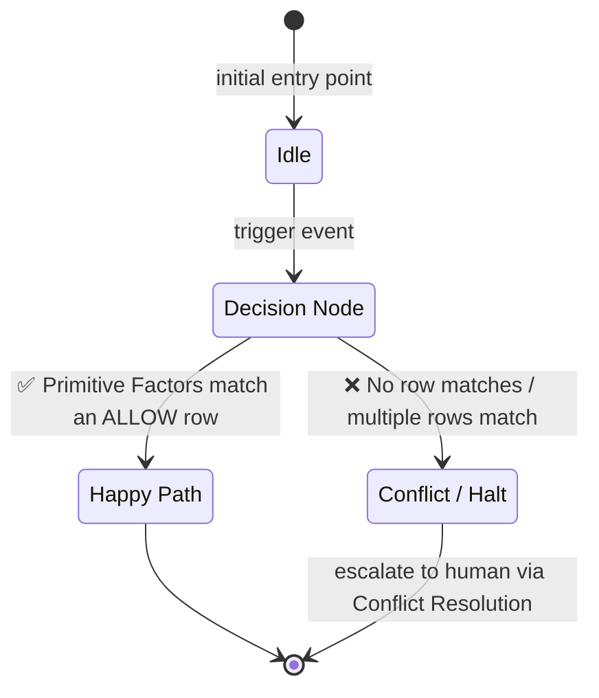

# {{Feature Title}} — Specification

**SPEC_VERSION:** v1.0.0 — draft

> ⚠️ **This is a freshly generated MDDD spec template.**
> Replace every `{{placeholder}}`, remove this banner, and refine the diagram + matrix
> with the real business context before marking the spec as `stable`.

---

## 1. Context

Describe **what** this spec governs and **why** it exists.

- **Domain:** `{{domain_name}}`
- **Feature / Module:** `{{feature_name}}`
- **Scope (in):** {{what is covered}}
- **Scope (out):** {{what is explicitly NOT covered}}
- **Owners:** {{team_or_person}}
- **Related specs:** {{parent_domain_spec, sibling_features}}

---

## 2. Behavioral Flow (Mermaid)

> Pick the diagram type that best fits the topology using mermaid-diagrams skill.

**Replace the diagram above with the real topology** for this feature.
Every node MUST correspond to a concrete state, action, or decision found in the Decision Matrix.

---

## 3. Decision Matrix

The matrix below is the **deterministic truth table** that resolves the flow above.
Each row maps a combination of **Primitive Factors** → a `Proposed Action` → a `Decision` (`✅ ALLOW` / `❌ DENY`) → an optional `Transition State`.

### 3.1 Primitive Factors

| Factor | Type | Allowed Values | Default |
| :--- | :--- | :--- | :--- |
| `{{Factor 1 (e.g. Active Tenant?)}}` | Binary | `✅ YES` / `❌ NO` | — |
| `{{Factor 2 (e.g. Active Billing Tier?)}}` | Categorical | `FREE`, `PRO`, `ENTERPRISE` | — |
| `{{Factor N}}` | Binary / Categorical | … | — |

> Use `-` (dash) as a wildcard when a column does not affect the decision.

### 3.2 Resolution Table

| {{Factor 1}} | {{Factor 2}} | … | Proposed Action | Decision | Transition State |
| :---: | :---: | :---: | :--- | :---: | :--- |
| ❌ NO | - | - | `{{ACTION_NAME}}` | ❌ DENY | - |
| ✅ YES | - | - | `{{ACTION_NAME}}` | ✅ ALLOW | `{{NEW_STATE}}` |

**Resolution rules** (per MDDD protocol, section 3.3):

1. ALL columns must match the current system state.
2. If no row fully matches → `HaltWithConflict` (section 5).
3. If multiple rows match → `HaltWithConflict` (ambiguous).

---

## 4. Tasks

Atomic, executable checklist extracted from the spec. Each item MUST be traceable
back to a node in the Behavioral Flow or a row in the Decision Matrix.

- [ ] {{Task 1 — derived from flow node / matrix row}}
- [ ] {{Task 2 — derived from flow node / matrix row}}
- [ ] {{Task N — derived from flow node / matrix row}}

---

## 5. Conflict Resolution Notes

When a `HaltWithConflict` is triggered, document the resolution path here:

| Conflict Source | Proposed Matrix Change | Status |
| :--- | :--- | :---: |
| {{Primitive Factor that caused the halt}} | {{new row / new column / renamed state}} | `OPEN` / `RESOLVED` |

---

## 6. Audit History

Click to expand

| Date | Agent | Version | Change Summary |
| :--- | :--- | :---: | :--- |
| {{YYYY-MM-DD}} | Cline (`md-new`) | v1.0.0 | **Spec created from template.** All placeholders pending replacement. Mermaid diagram uses a generic state lifecycle as a structural seed. Decision Matrix seeded with one wildcard row — must be expanded to cover the real primitive factors before `md-impl` is invoked. Status: **draft**. |

